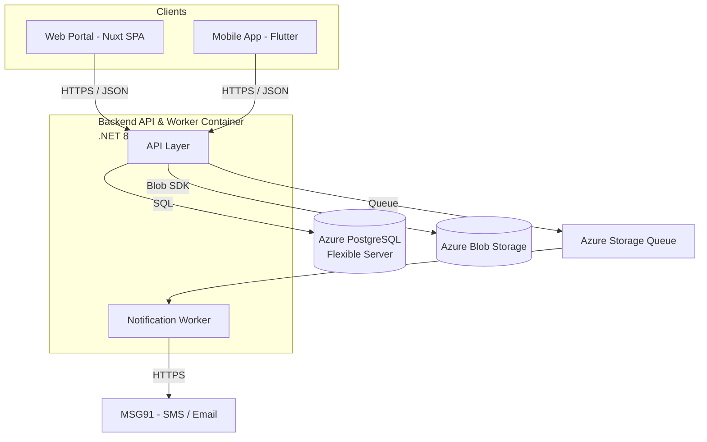
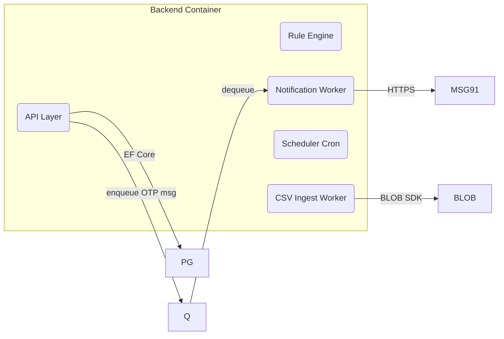
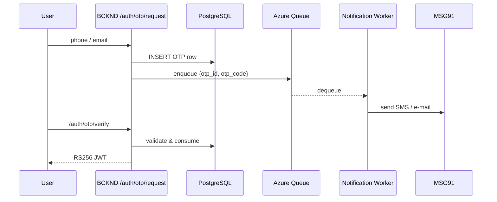
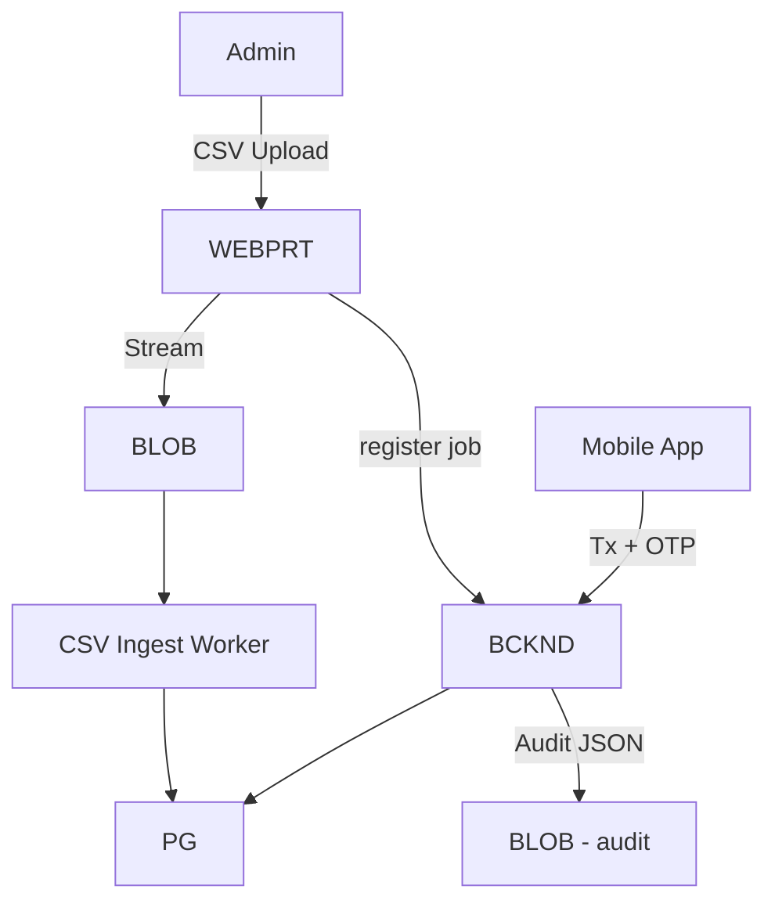
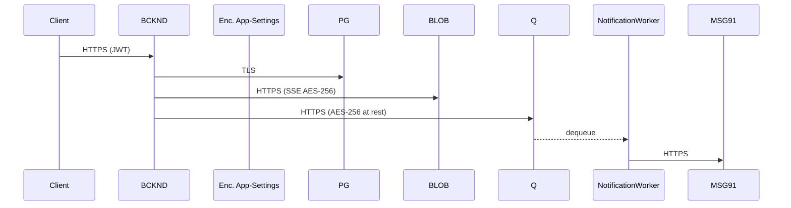
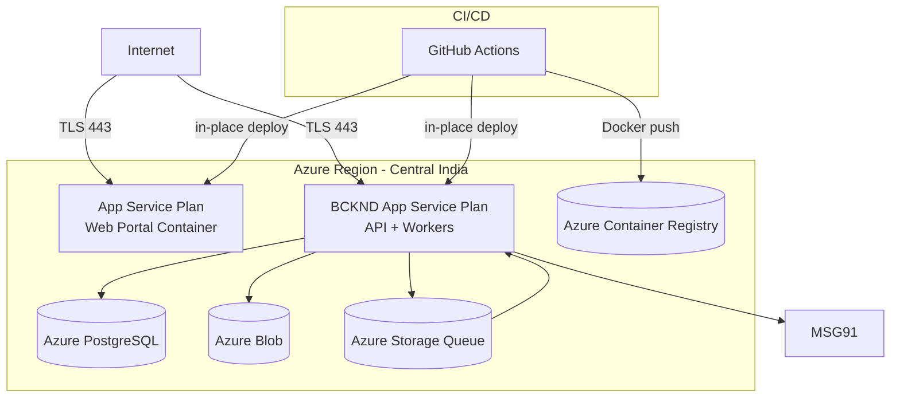

## L1-HLD: High-Level Design (HLD) Document

### 1. Purpose & Scope  
This High-Level Design (HLD) provides a cohesive, technology-focused view of PromoPartner, the Essilor-Luxottica joint-promotions platform. It summarises the major building blocks, their interactions, data strategy, security posture, deployment topology, and the key assumptions that bound the architecture. The document is intentionally concise; detailed service internals and implementation tasks reside in L2 / L3 artefacts.

---

### 2. Architecture Overview  
PromoPartner is a cloud-native, single-tenant solution built on Microsoft Azure. It comprises two cloud runtime services (Web Portal and Backend) plus Mobile App client—along with managed Azure services for data, storage, and messaging.  
Ingress traffic terminates on two public Azure App Service endpoints secured with TLS.  
• Web-Portal endpoint: optional office-IP allow-list enforced.  
• API endpoint (Mobile + Portal): open to the public Internet and protected by JWT, rate-limiting and Azure-standard DDoS defences.  
No edge gateway, WAF, or VNet isolation is introduced (Client Clarification #1).

#### Architecture Overview Diagram

---

### 3. System Services  

| Code | Service | Responsibility Summary |
|------|-----------|------------------------|
| WEBPRT | Nuxt 3 SPA served by Azure App Service | Admin: master-data maintenance, promotion design, reconciliation, reporting; KAM: read-only access for viewing promotions and reporting (no access to PUT, PATCH, DELETE endpoints) |
| APP | Flutter iOS/Android application | Store & Parent-Store promotion execution, reconciliation, child-store maintenance |
| BCKND | .NET 8 modular monolith in a Linux container (includes internal notification worker process) | Public REST API, promotion rule engine, Customer Verification/OTP flows, transaction FSM, CSV ingest, schedulers, notification worker |
| PG | Azure PostgreSQL Flexible Server | Authoritative relational store (<100 k SKUs, ≤5 k stores, ≤100 k tx/day) |
| BLOB | Azure Blob Storage | Two containers: (a) `audit` – immutable, indefinite retention; (b) `assets` – CSV imports & marketing banners, Hot tier, mutable |
| Q | Azure Storage Queue | Decouples OTP & e-mail dispatch from request path (encrypted with service-side AES-256) |
| MSG91 | External SaaS | SMS & e-mail delivery via REST API |

#### System Services Diagram

---

### 4. Inter-Service Communication  

All synchronous traffic is JSON/HTTPS; asynchronous traffic uses Azure Storage Queue with base-64 JSON payloads encrypted at rest.

The following table illustrates key API endpoints. Complete endpoint specifications are documented in L3-LLD.

| Caller → Callee | Endpoint (prefix `/v1`) | Method | Purpose |
|-----------------|-------------------------|--------|---------|
| WEBPRT / APP → BCKND | `/auth/otp/request` | POST | Issue OTP |
| ″ | `/auth/otp/verify` | POST | Verify OTP, issue JWT |
| ″ | `/promotions/evaluate` | POST | Return eligible promotions |
| ″ | `/transactions` | POST | Create transaction (idempotent) |
| WEBPRT → BCKND | /csv-jobs/<entity>/sas-url | GET | Get SAS URL for CSV upload |
|  WEBPRT → BCKND | /csv-jobs/<entity>/register | POST | Register uploaded CSV file |

* Web Portal receives JWT in HTTP-only cookie; Mobile App receives JWT in response body for secure local storage

#### Inter-Service Communication (OTP flow)  

---

### 5. Data Architecture Details  
1. **Relational Core** – Single PostgreSQL instance, time-range partitioned tables for `transactions` & `otp` to maintain index performance.  
2. **Catalogue UPSERT** – All product & store master data loaded via streamed CSV; pipeline performs schema validation and upserts on primary key `sku` or `store_id`.  
3. **Rule Storage** – Raw JSON and compiled SQL snippets stored in `promotion_rules` table for fast in-memory caching.  
4. **Audit Log** – Domain events serialised to immutable Blob container `audit/YYYY/MM/DD/*.json`; no retention limit.  
5. **PII Retention** – Business-mandated **indefinite retention of all PII**, including customer contact data; therefore **no purge job** is scheduled. (Confirmed by Compliance)

#### Data Flow Diagram – Level 0

---

### 6. Integration Points  
* MSG91 SMS: HTTPS REST, API key in App-Service settings  
* MSG91 Email: HTTPS REST API via MSG91 (same endpoint as SMS with email-specific parameters)
* Apple App Store / Google Play: distribution only  
* No third-party payment, ERP, or SSO integrations are in scope for phase 1.

---

### 7. Technology Choices  

| Layer | Technology |
|-------|------------|
| Compute | Azure App Service (Linux container) |
| Backend | .NET 8, ASP.NET Core, EF Core |
| Front-end | Nuxt 3 (TypeScript) |
| Mobile | Flutter 3 (Dart) |
| Data | Azure PostgreSQL Flexible Server (Burstable B2ms) |
| File Storage | Azure Blob (Hot tier for `assets`, Cool for aged objects, immutable `audit`) |
| Messaging | Azure Storage Queue |
| Auth | Custom OTP + RS256 JWT |
| Logging | Serilog → Azure Application Insights |
|  CI/CD | GitHub Actions → Docker build → push to Azure Container Registry (ACR) → az webapp config container set for in-place deployment |

---

### 8. Security Architecture Overview  
The security model is OTP-centric, token-based, and encryption-everywhere.

#### Key Measures  
1. **Authentication** – 6-digit OTP via both SMS and Email for all users, login OTP: 10-min TTL; customer-verification OTP: 5-min TTL, max 5 attempts. Backend enforces lockout after 5 failed attempts within 10 minutes with a 15-minute lockout window
2. **Authorisation** – RS256-signed JWT (60 min) with role & store claims; Web Portal: stored in HTTP-only cookies; Mobile App: stored in secure local storage (Flutter Secure Storage) and passed via Authorization headers; refresh token (12 h) follows same storage pattern. Note: Mobile apps cannot use HTTP cookies due to lack of browser context.
3. **Secrets** – Stored in encrypted App-Service settings without Azure Key Vault; manual rotation during maintenance  
4. **Data-in-Transit** – TLS 1.2 on all public endpoints; Storage Queue, Blob and ACR enforce HTTPS.  
5. **Data-at-Rest** – AES-256 server-side encryption for PostgreSQL, Blob and Queue; immutable `audit` container prevents deletion. OTP codes stored as plaintext in PostgreSQL (no application-level encryption); relies on Azure's database encryption-at-rest.
6. **Perimeter** – Web-Portal endpoint protected by office-IP allow-list; API endpoint exposed publicly (no IP lock) to support mobile clients.  
7. **Compliance** – All PII retained indefinitely as per confirmed business policy.

#### Security Architecture Diagram

---

### 9. Deployment Architecture  
A single Azure subscription hosts one production environment; deployments occur via in-place deployment during a 5-minute maintenance window.
#### Deployment Architecture Diagram

* No DR region or automated alerting is provisioned (client-accepted risk).  
* Vertical scale-up remains the sole growth path; service decomposition will be revisited only when sustained load exceeds thresholds.

---

### 10. Constraints & Assumptions  
* Single-region deployment; **service unavailable until region recovery** (accepted business risk).  
* Web-Portal IP allow-list enforced; API endpoint publicly reachable.  
* OTP codes stored as plaintext without encryption in PostgreSQL (accepted risk), protected only by database-level encryption.  
* Online-only mobile client; no offline cache or local queue.  
* Platform relies solely on Azure Database for PostgreSQL's built-in automated daily backups (7-day PITR) with no disaster recovery capabilities. 
* Authorization enforces role-based restrictions on transaction state transitions.
* Numeric API latency SLOs are deliberately omitted at client request.
* KAM users have read-only access with no permissions for PUT, PATCH, or DELETE endpoints
---

### 11. Glossary  
OTP – One-Time Password  
JWT – JSON Web Token  
PII – Personally Identifiable Information  
FSM – Finite State Machine  
PITR – Point-In-Time Restore  

---

*End of Document*
