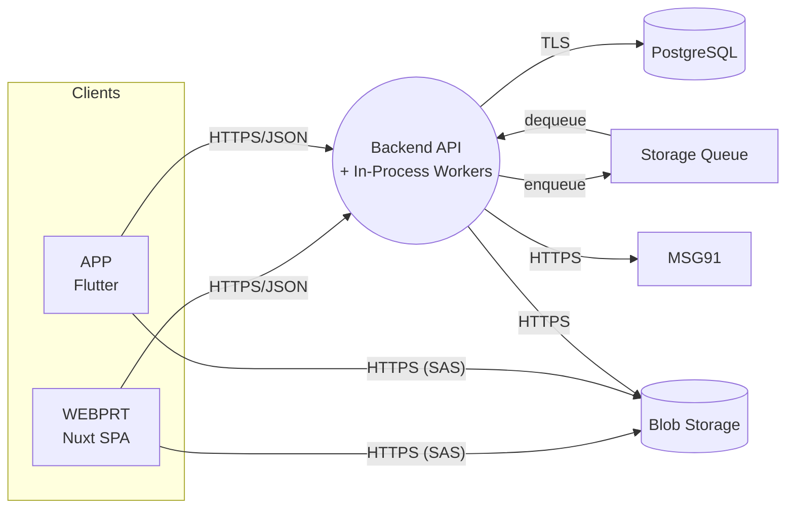
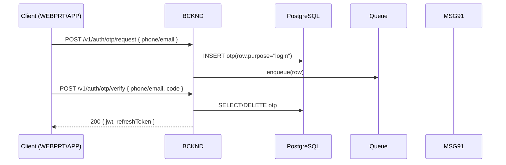
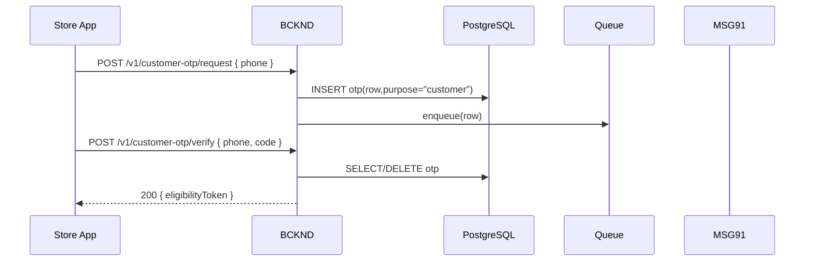
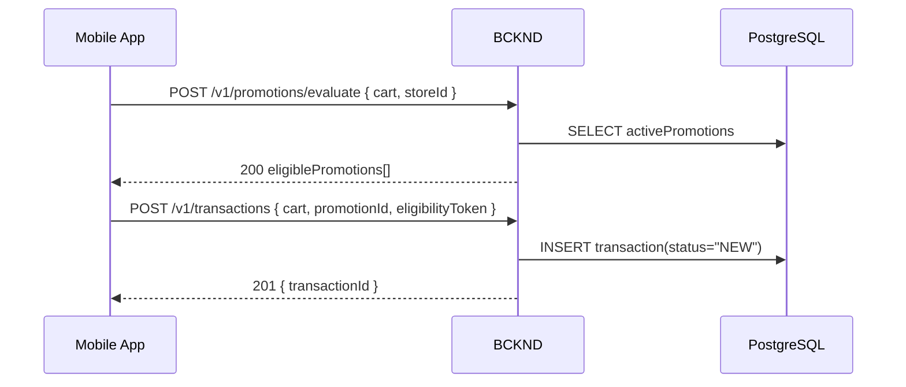
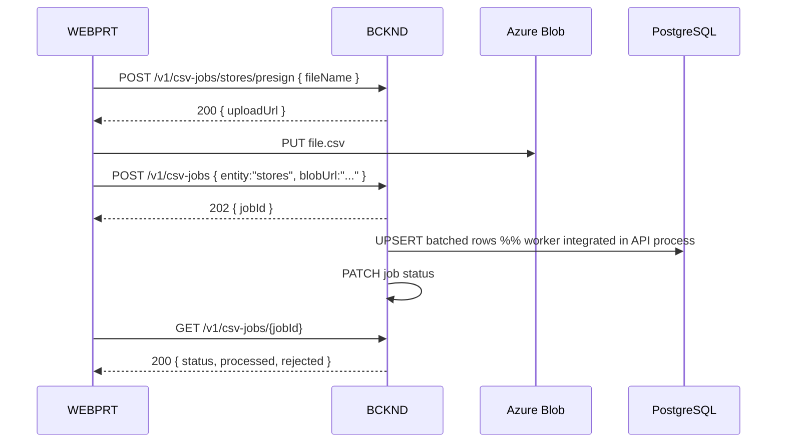

## L2-LLD-IC: Inter-Component Interaction Design Document

### 1. Purpose & Scope
This Level-2 document standardises **all run-time interactions** between the three runtime components of PromoPartner—Backend (BCKND), Web Portal (WEBPRT) and Mobile App (APP)—and the supporting Azure services (PostgreSQL, Blob, Queue, MSG91).  
All REST endpoints are rooted under the immutable base path **`/v1`**; this establishes a clear versioning contract across components.  
It is the single reference for:

* Public REST contract (paths, verbs, payload skeletons, status codes)  
* Role–endpoint permission matrix consumed by API middleware  
* Cross-component authentication & token lifecycle  
* File-transfer, asynchronous messaging and database-sync strategies  
* Uniform error envelope and data-security guarantees  

Internal algorithms and in-process class diagrams are intentionally excluded and deferred to L3-LLD documents.

---

### 2 Services and Modules Landscape
The table below purposefully hides in-process implementation details (workers, helpers, etc.) and lists only externally observable runtimes.

| Code | Runtime | Responsibility (external view only) |
|------|---------|-------------------------------------|
| **BCKND** | .NET 8 container in Azure App Service | Exposes REST API, persists to PostgreSQL, pushes OTP/e-mail jobs to Queue, streams files to Blob |
| **WEBPRT** | Nuxt 3 SPA served from Azure App Service | Calls BCKND for CRUD, renders Admin/KAM UI, streams CSV & banner files to Blob |
| **APP** | Flutter 3 iOS/Android binary | Calls BCKND for promotion discovery, OTP, transaction & reconciliation |
| **PG** | Azure PostgreSQL 16 | Authoritative relational store |
| **BLOB** | Azure Blob Storage | `assets` (mutable) & `audit` (immutable) containers |
| **QUEUE** | Azure Storage Queue | Decouples OTP / e-mail dispatch |
| **MSG91** | SaaS | SMS + e-mail delivery |

---

### 3. High-Level Communication Topology
The diagram now includes direct client↔Blob traffic for SAS-based uploads/downloads and clarifies that the Notification Worker executes **in-process** inside the Backend container.



* All synchronous traffic = JSON over TLS 1.2 (minimum, upgrade to 1.3 when App Service GA's support).  
* All async traffic = Base-64 JSON inside Storage Queue, AES-256 at rest.  
* No other network paths exist.

---

### 4. Communication Patterns  
PromoPartner uses two primary communication paradigms: synchronous REST for interactive workflows and asynchronous messaging for non-blocking tasks such as OTP delivery and overnight schedulers.

#### 4.1 Synchronous REST
* Stateless HTTP/1.1 requests with `Authorization: Bearer <JWT>` header.  
* JSON UTF-8 bodies; field names use `camelCase`.  
* Every URI starts with `/v1` (e.g., `/v1/auth/otp/request`).  
* Breaking changes require a new base path (`/v2`) and formal change notice.

#### 4.2 Asynchronous Messaging
* BCKND enqueues `{ otpId, code, channel, recipient, purpose }` on QUEUE.  
* In-process Notification Worker pops, calls MSG91, marks row `sent=true` in DB.  
* Retry & poison-message policies handled via Polly; details live in L3-LLD-BCKND.  
A JSON Schema (`otpMessage-v1.json`) stored in the contracts repo defines the queue payload and is validated on both enqueue and dequeue.

#### 4.3 File Transfer (CSV, banners, reports)
* BCKND issues **time-limited SAS URL** (`PUT` for upload, `GET` for download).  
* Client streams file directly to Blob, then calls `/v1/csv-jobs` or `/v1/reports/{id}` to start processing or fetch status.  
* Maximum single-file size = 50 MB (L1-NFRS §2).

---

### 5. Key Interaction Sequences  
Diagrams omit internal modules and show only observable actors.

#### 5.1 Login OTP (User Authentication)



#### 5.2 Customer-Verification OTP (Eligibility Token)



#### 5.3 Promotion Evaluation ➔ Transaction Creation



#### 5.4 CSV Ingest (SAS Variant)



---

### 6. Canonical Envelope & Status Codes  
This envelope is shared by all successful and error responses, enabling uniform client-side deserialisation and tracing.

```json
// success
{
  "data": { /* resource-specific payload */ },
  "meta": { "traceId": "f571…" }
}

// error
{
  "error": {
    "code": "SKU_DUPLICATE",
    "message": "The supplied SKU already exists.",
    "details": { "sku": "ABC123" }
  },
  "meta": { "traceId": "f571…" }
}
```

| Category | HTTP Status | Typical `code` |
|----------|-------------|----------------|
| Validation error | 400 / 422 | `FIELD_REQUIRED`, `INVALID_FORMAT` |
| Auth/Z auth | 401 / 403 | `UNAUTHENTICATED`, `FORBIDDEN` |
| Conflict / FSM | 409 | `STATUS_TRANSITION_INVALID` |
| Not found | 404 | `RESOURCE_NOT_FOUND` |
| Rate-limit | 429 | `RATE_LIMIT_EXCEEDED` |
| Server | 500 | `UNEXPECTED_ERROR` |

---


_End of document_
```
