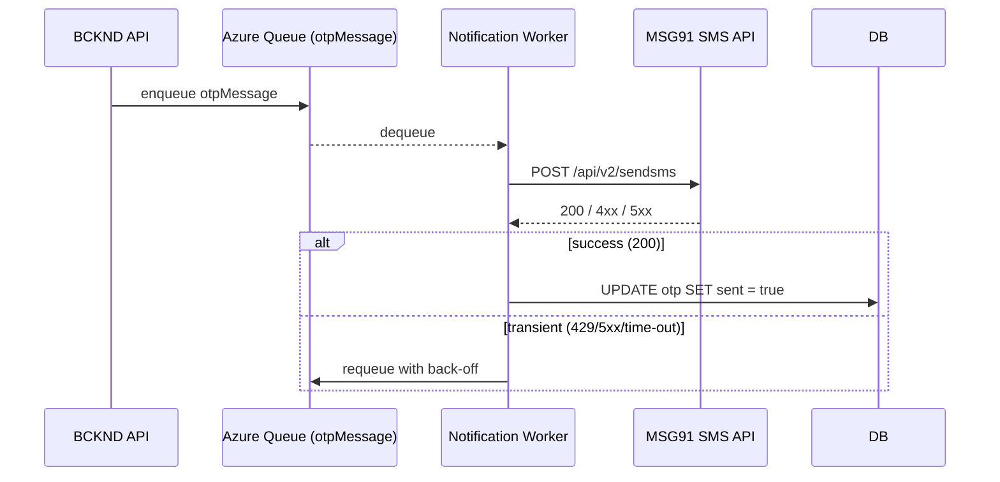
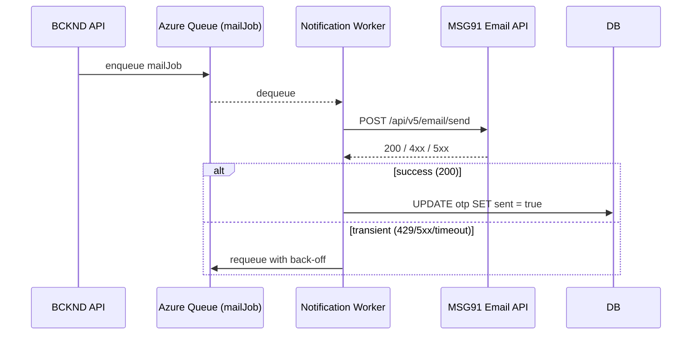

## L2-LLD-INTG3P: Integration with Third-Party Services  Document

### 1. Purpose & Scope
This Level-2 document defines how PromoPartner interacts with external third-party services at run-time and during the build/release process.  It complements L2-LLD-IC by focusing exclusively on cross-cutting integration concerns—API contract details, authentication, data mapping and resilience patterns—without describing component internals.  All requirements reflect the current, single-region, ≤5 000-user scale and consciously avoid over-engineering.

---

### 2. External Service Inventory
The table below lists every third-party service that PromoPartner calls directly.  For each service we capture its high-level capability, how it is invoked, and the relative frequency of calls so that the engineering team can size time-outs, retries and monitoring appropriately.

| Code | Service | Capability | Run-Time Interaction | Change Frequency |
|------|---------|------------|----------------------|------------------|
| MSG91-SMS | MSG91 SendSMS v2 REST API | SMS/Email delivery for login/customer OTP & transactional confirmations | HTTPS `POST /api/v2/sendsms` | High (per OTP) |
| MSG91-MAIL | MSG91 RESTAPI  | E-mail delivery for Admin/KAM OTP  |  | Medium |
| APP-STORES | Apple App Store / Google Play | Mobile binary distribution (CI/CD only) | Fastlane CI upload (build-time only) | Low |

---

### 3. Design Principles for External Integrations
This section explains the mindset that shapes every outbound integration so that future contributors can apply the same rationale consistently.

1. **Keep the core stateless:** All outbound sends originate from the in-process _Notification Worker_ that listens on Azure Storage Queue; the public API thread is never blocked on third-party I/O.  
2. **Single vendor for phase 1:** A single provider (MSG91) satisfies the current functional and regulatory needs; pluggability will be reconsidered only if volumes or SLA demands change.  
3.   
**Explicit environment configuration:** Sender IDs, DLT template IDs and “from” addresses are injected via encrypted App-Service settings so that changes can be rolled out through the standard deployment pipeline without schema or UI work.  
4. **Fail-safe queueing:** Messages remain in the Azure Storage Queue until delivered or the **15-minute TTL** expires, guaranteeing that users never receive expired OTP codes.  

---

### 4. Detailed Service Interfaces

Each subsection first provides textual context on why the integration exists, then documents the interface contract, data mapping, diagrams and error-handling rules required for implementation.

#### 4.1 MSG91 SMS – Transactional SendSMS v2 API
The backend generates and verifies OTP codes; MSG91 is responsible purely for SMS transport under India’s TRAI DLT regime.

| Item | Value |
|------|-------|
| Endpoint | `POST https://api.msg91.com/api/v2/sendsms` |
| Auth header | `authkey: <32-char API key>` (stored in **encrypted App-Service setting** `MSG91_SMS_AUTHKEY`) |
| Content-Type | `application/json; charset=utf-8` |
| TLS | 1.2 for all public endpoints |
| Throttle assumption | ≤150 TPS (bench-marked with MSG91 support); Notification Worker concurrency is dynamically capped at the lower of CPU × 8 or the calculated TPS budget. |

##### Request Mapping
Internal OTP row ⟶ MSG91 payload

```jsonc
{
  "sender": "<senderId>",          // e.g. "ESSLUX"
  "route": "4",
  "country": "91",
  "sms": [
    {
      "message": "<dltTemplateBody>",     // e.g. "Your OTP is {{code}} and is valid for {{ttl}} minutes."
      "to": ["<10-digit-phone>"],
      "variables_values": "<code>|<ttlMinutes>",
      "template_id": "<dltTemplateId>"
    }
  ]
}
```
`template_id` is mandatory for route 4 messages and is sourced from the environment variable `MSG91_SMS_OTP_TEMPLATE_ID`.

##### Response Mapping
```jsonc
{
  "type": "success",
  "message": "SMS sent successfully.",
  "data": { "group_id": "abcd1234…" }
}
```
*HTTP 200* ⇒ mark OTP row `sent = true` via direct DB update; any other status triggers the retry logic.

##### Interaction Diagram

The worker updates the database directly rather than looping back through HTTP, avoiding internal network hops.

---

#### 4.2 MSG91 E-mail – REST API
No marketing or scheduled reports are sent in phase 1.

| Item | Value |
|------|-------|
| Endpoint | `POST https://api.msg91.com/api/v5/email/send` |
| Auth header | `authkey: <32-char API key>` (stored in encrypted App-Service setting `MSG91_EMAIL_AUTHKEY`) |
| Content-Type | `application/json; charset=utf-8` |
| TLS | 1.2 for all public endpoints |
| Template handling | OTP subject/body configured as MSG91 email templates with variables |

##### Email API Request Example
{
  "to": [{"email": "admin@example.com"}],
  "from": {"email": "no-reply@essilorluxottica.com"},
  "domain": "essilorluxottica.com",
  "template_id": "<email_template_id>",
  "variables": {
    "code": "123456",
    "ttl": "10"
  }
}

##### Sequence Diagram


---

#### 4.3 Mobile-Store Distribution (Build-Time Only)
Fastlane tasks in the GitHub Actions pipeline authenticate with Apple App Store Connect (JWT key in a secured repository secret) and Google Play (service-account JSON stored likewise) to upload `.ipa` and `.aab` artefacts.  No run-time interaction exists; therefore no resilience flows are documented here.

---

### 5. Authentication & Secrets Management
Consistent secret handling prevents credential sprawl and surprises between environments.

1. All MSG91 credentials (`MSG91_SMS_AUTHKEY`, `MSG91_EMAIL_AUTHKEY`) and build-store keys are stored in encrypted **App-Service settings**, which themselves are encrypted at rest by Azure.  No Key Vault is introduced.  
2. Rotation is manual during the quarterly maintenance window documented in Operations SOP.  
3. An emergency rotation playbook (separate Ops document) defines the on-call engineer’s steps to cut over to new credentials within 1 hour of suspected compromise.

---

### 6. Data Transformation Rules
Every outbound message is assembled from internal records plus static template fragments.  The tables below make that mapping explicit so that developers and QA share a single truth.

#### 6.1 SMS
| Internal Field | SMS JSON Field | Notes |
|----------------|---------------|-------|
| `otp.code` | `variables_values` (first pipe) | Numeric string, 6 chars |
| `otp.ttlMinutes` | `variables_values` (second pipe) | 5 or 10 per OTP type |
| `otp.phone` | `sms[x].to[0]` | Must match `^[6-9]\d{9}$`; non-Indian numbers rejected |
| `senderId` | `sender` | 6 uppercase letters, DLT approved |
| `dltTemplateId` | `template_id` | 19-char alphanumeric; validation enforced |

#### 6.2 E-mail
| Internal Field | API JSON Field | Constraints |
|----------------|-----------------------------|-------------|
| `otp.code` | `variables.code` | 6 chars |
| `otp.ttlMinutes` | `variables.ttl` | 5 or 10 |
| `mail.from` | `from.email` | Domain `essilorluxottica.com` only |
| `mail.to` | `to[0].email` | RFC 5322 validated |
| `email_template_id` | `template_id` | Pre-configured in MSG91 |
| `domain` | `domain` | `essilorluxottica.com` |

---

### 7. Error Handling & Resilience
The policies below are tuned for the modest message volumes (<50 k/day) and avoid the complexity of circuit-breaker libraries or multi-provider fall-back.

#### 7.1 Timeout & Retry Policy
| Channel | Timeout | Retries | Back-off (s) | Queue TTL |
|---------|---------|---------|--------------|-----------|
| SMS (HTTP) | 5 s | 3 | 2, 4, 8 | 900 s (15 min) |
| E-mail (HTTP) | 5 s | 3 | 2, 4, 8 | 900 s (15 min) |

*Transient* errors (HTTP 429/5xx, socket time-out, SMTP 4xx) trigger the retry cycle. *Permanent* errors (HTTP 4xx other than 429, SMTP 5xx) are logged once and dropped.

#### 7.2 Fallback Mechanism
No alternate provider is configured; messages that exceed the retry window or age out past TTL are marked `FAILED` and surfaced via monitoring (see §8).

---

### 8. Operational Monitoring & Reporting
Light-weight metrics are emitted to Azure Application Insights so that Operations can catch systemic delivery failures early.

1. Custom metric `notification_send_failures{channel}` incremented on every dropped message.  
2. Alert rule: *>100 failures within 5 minutes* ⇒ Ops e-mail + SMS to on-call.  
3. Metric `otpQueueDepth` sampled every minute; warning threshold 1 000.  
4. Daily aggregate CSV (total sent, success %, avg latency) written to Blob for audit; individual message attempts are **not** logged to the immutable audit container, preserving storage and staying within original audit scope.

---

### 9. Security & Regulatory Compliance
This subsection clarifies how the integration satisfies India’s DLT regulations and the client’s internal security standards.

* **DLT compliance:** `senderId` and `template_id` must match the operator-approved records; application-side validation rejects messages lacking these fields.  
* **PII minimisation:** Only phone numbers and e-mail addresses are transmitted; no customer names or purchase data leave PromoPartner.  
* **Encryption:** All transport channels use TLS 1.2+; App-Service encrypted settings protect credentials at rest.  
* **Audit:** Aggregated daily send statistics are sufficient for financial reconciliation; per-message payloads are deliberately excluded from the immutable audit log to avoid storing OTP codes.

---

### 10. Implementation Notes
The concrete implementation details live in component-level L3 documents; the bullets below merely tie this integration spec back to those artefacts.

* BCKND-L3-NotificationWorker defines the typed clients and retry code conforming to §7.  
* DevOps-L3-Pipelines document covers injection of App-Service settings and secret rotation.  
* QA test-plan includes contract tests for SMS JSON and SMTP sessions using MSG91 Sandbox.

---

_End of document_