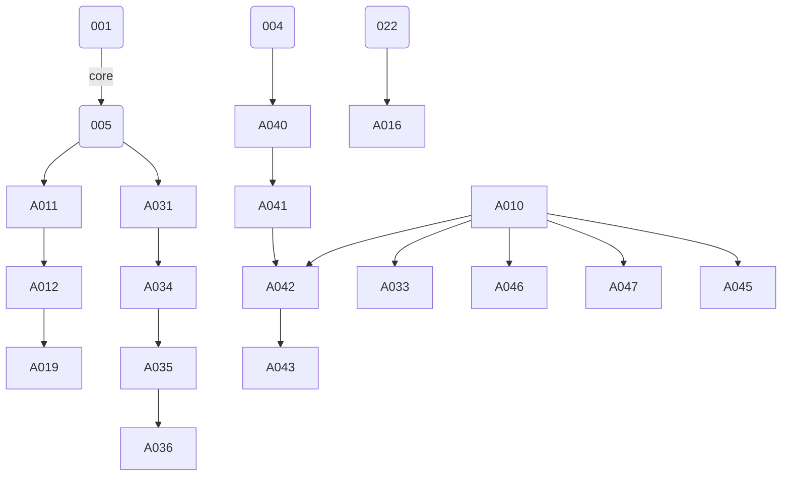

## L3-IB-BCKND: Component Implementation Backlog for BCKND

### 1. Purpose & Scope  
This backlog decomposes every functional and non-functional requirement of the Backend (BCKND) into atomic, assignable work items.  
• Source Inputs: L3-FRS-BCKND v1.0, L3-LLD-BCKND v1.1, L3-NFRS-BCKND v1.0, L3-KD-BCKND, Consolidated Client Clarifications.  
  
• Estimation Scale: Fibonacci story-points {1, 2, 3, 5, 8, 13}.  
• Priority Codes:  
  – M = “Must” for go-live scope  
  – S = “Should” once all Musts of the same epic are finished  
  – C = “Could” / stretch  

### 2. Backlog Legend  
| Column | Meaning |
|--------|---------|
| ID | Unique, immutable backlog identifier |
| Title | One-line summary (user-story or technical task) |
| Tech Req. | Key implementation notes / design constraints |
| Acceptance Criteria | Bullet list of verifiable outcomes |
| Traceability | FR / TSD / LLD / KD references |
| Deps. | Up-stream backlog IDs (blocking) |
| Est. | Story points |
| Prio. | M / S / C |

---

### 3. Foundation & Cross-Cutting (Slice-Independent)

| ID | Title | Tech Req. | Acceptance Criteria | Traceability | Deps. | Est. | Prio. |
|----|-------|----------|---------------------|--------------|-------|------|-------|
| IB-BCKND-001 | Bootstrap .NET 8 modular-monolith solution | Create top-level sln, vertical-slice folder structure, add MediatR, EF Core, Serilog | Repo builds + runs `dotnet test`; empty `/healthz` returns 200 | LLD §2 | — | 3 | M |
| IB-BCKND-002 | Global JSON envelope & error middleware | Implement custom success/error envelope per L2-LLD-IC §6 (`data`/`error` + `meta.traceId`). | Any unhandled ex → 500 + custom envelope; domain error → 4xx + custom envelope. | LLD §6 | 001 | 2 | M |
| IB-BCKND-003 | Serilog → App Insights sink | Correlate `traceId`, redact OTP codes | Logs visible in AI; OTP regex replaced by `"***"` | NFRS §6, §4.2, KD-BCKND-2 | 001 | 2 | M |
| IB-BCKND-004 | Health endpoints `/healthz`, `/readyz` | Ready = DB + Queue ping | `GET /readyz` returns 503 when DB down | NFRS §6 | 001 | 1 | M |
| IB-BCKND-005 | EF Core DbContext & initial migrations | Generate EF Core migrations for tables listed in FRS §4.1; partitioned ones use parent+child strategy (no Flyway). | Unit test verifies table list | FRS §4, LLD §5 | 001 | 5 | M |
| IB-BCKND-006 | JWT & refresh-token utility | RS256, RSA key from env, `tokenVersion` claim | Valid JWT issued & validated in sample test | FRS 101-103, NFRS §4.1 | 001 | 3 | M |
| IB-BCKND-007 | Sliding-window rate-limiter middleware | In-mem, 64 k bucket, 60 s TTL (risk: duplicate counting during slot-swap accepted for MVP; see KD-1). | 6ᵗʰ OTP request/min → HTTP 429 + `Retry-After` | FRS 101, NFRS §4.1 | 001 | 3 | M |
| IB-BCKND-008 | ETag / optimistic concurrency helper | Adds `If-Match` handling | Update with stale ETag → 412 | FRS 203 | 005 | 2 | M |
| IB-BCKND-009 | Audit event writer to immutable Blob | Append-only, gzip JSON; exclude fields per FR 1102 | Create / update via sample endpoint writes blob file | FRS 1101-1102, KD-3 | 005 | 3 | M |
| IB-BCKND-010 | PostgreSQL advisory-lock helper | Wraps `pg_try_advisory_lock` | Demo console cmd acquires & releases lock | LLD §3, KD-4 | 005 | 1 | M |

---

### 4. Authentication & Session Management Epic

| ID | Title | Tech Req. | Acceptance Criteria | Traceability | Deps. | Est. | Prio. |
|----|-------|----------|---------------------|--------------|-------|------|-------|
| IB-BCKND-011 | Endpoint `POST /auth/otp/request` | Uses rate-limiter, inserts OTP row, enqueues JSON to Queue | • 202 Accepted (no body except envelope)  • 6ᵗʰ req/min → 429  • Row in `otp_YYYY_MM`  • Queue message conforms INTG3P §4  • No `otpId` leaked in response | FR 101, LLD §6.1 | 005,007 | 3 | M |
| IB-BCKND-012 | Queue schema + enqueue adapter | Base-64 payload, AES-256 at rest | Message visible in Azure Storage Explorer | FR 1001, LLD §6.1 | 011 | 1 | M |
| IB-BCKND-013 | Endpoint `POST /auth/otp/verify` | Validates code, sets `consumed_at`, issues JWT + refresh | • Wrong code → 400  • Expired → 410  • Success → 200 with tokens | FR 102 | 006 | 3 | M |
| IB-BCKND-014 | Endpoint `POST /auth/refresh` | Single refresh rotation, multiple devices | • Old refresh token rejected after use | FR 103 | 006 | 2 | M |
| IB-BCKND-015 | JWT middleware: tokenVersion check | Compare `ver` claim vs user row | Stale token → 401 | FR 106 | 006 | 1 | M |
| IB-BCKND-016 | Token revocation on user de-activate | `PATCH /users/{id}` sets `active=false` → increment `tokenVersion` | Subsequent call with old token → 401 | FR 104,203 | 022,015 | 2 | M |
| IB-BCKND-017 | Customer OTP `POST /customer-otp/request` | Rate-limit 3/min, purpose=`CUSTOMER` | 4ᵗʰ req/min → 429 | FR 105 | 011 | 2 | M |
| IB-BCKND-018 | Customer OTP verify + eligibility token | Insert `eligibility_tokens`, TTL 15 min | Token usable once; second use → 410 | FR 105,1201 | 017 | 3 | M |

---

### 5. Notification Worker Epic

| ID | Title | Tech Req. | Acceptance Criteria | Traceability | Deps. | Est. | Prio. |
|----|-------|----------|---------------------|--------------|-------|------|-------|
| IB-BCKND-019 | BackgroundService: OTP dispatcher | Poll every 5 s, send via MSG91, update `sent=true`, retry ×3 | • Success marks `sent`  • Retry ≤3 while `expires_at ≥ NOW()`  • On expiry set status=`FAILED`, move message to `otp-poison` queue, log `ERROR` | FR 1001-1002, LLD §3 | 012 | 5 | M |

---

### 6. User & Role Management Epic

| ID | Title | Tech Req. | Acceptance Criteria | Traceability | Deps. | Est. | Prio. |
|----|-------|----------|---------------------|--------------|-------|------|-------|
| IB-BCKND-020 | GET `/users` list + filters | Offset pagination 50/200 | • Default page = 1 size = 50  • Role filter works | FR 201 | 005,006 | 2 | M |
| IB-BCKND-021 | POST `/users` create | Role/parent-store validation | Parent-store user can’t create outside hierarchy | FR 202 | 005 | 3 | M |
| IB-BCKND-022 | PATCH `/users/{id}` update/deactivate | Uses ETag helper; on deactivate triggers 016 | • Stale ETag → 412  • Active → false increments `tokenVersion` | FR 203,104 | 008,016 | 3 | M |

---

### 7. Master-Data Epic (Products & Stores)

| ID | Title | Tech Req. | Acceptance Criteria | Traceability | Deps. | Est. | Prio. |
|----|-------|----------|---------------------|--------------|-------|------|-------|
| IB-BCKND-024 | GET `/products` list | Filter by `sku`/attr, paging | Returns ≤200 rows, correct filter | FR 301 | 005 | 2 | M |
| IB-BCKND-025 | POST `/products` create | Validate `sku` uniqueness | Duplicate → 409 | FR 302 | 005 | 2 | M |
| IB-BCKND-026 | PUT `/products/{sku}` upsert | UPSERT semantic | Inserts or updates row; idempotent | FR 303 | 005 | 2 | M |
| IB-BCKND-027 | GET/POST `/stores` | Role scope enforcement | Parent-store user sees children only | FR 304 | 005 | 3 | M |

---

### 8. Group Management Epic

| ID | Title | Tech Req. | Acceptance Criteria | Traceability | Deps. | Est. | Prio. |
|----|-------|----------|---------------------|--------------|-------|------|-------|
| IB-BCKND-028 | `/store-groups` create & list | JSON grammar per FR 401; groups resolve dynamically on every evaluation (no freezing). | Create returns HTTP 201; evaluation shows up-to-date members after store attribute change. | FR 401 | 024,027 | 5 | M |
| IB-BCKND-029 | `/product-groups` create & list | Same dynamic-expression grammar. | Create returns HTTP 201; promotion evaluation reflects attribute changes. | FR 402 | 024 | 5 | M |

---

### 9. Promotion Lifecycle Epic

| ID | Title | Tech Req. | Acceptance Criteria | Traceability | Deps. | Est. | Prio. |
|----|-------|----------|---------------------|--------------|-------|------|-------|
| IB-BCKND-030 | GET `/promotions` list | Status filter, paging | Default sort `createdAt DESC` | FR 501 | 005 | 2 | M |
| IB-BCKND-031 | POST `/promotions` create + rule compile | Validate JSON vs Draft-07 schema; compile & cache | Invalid schema → 422; valid → 201 & cache entry | KD-BCKND-8, LLD §3 | 028,029 | 8 | M |
| IB-BCKND-032 | PATCH `/promotions/{id}/status` | FSM guard, no Draft⇄Paused direct | Disallowed transition → 400 | FR 503 | 031 | 3 | M |
| IB-BCKND-033 | Scheduler: status flip & archive | Cron `0 0 * * *` | Promos auto-archived when `endDate < NOW()` | FR 504, LLD §3 | 010,032 | 3 | M |

---

### 10. Promotion Evaluation Epic

| ID | Title | Tech Req. | Acceptance Criteria | Traceability | Deps. | Est. | Prio. |
|----|-------|----------|---------------------|--------------|-------|------|-------|
| IB-BCKND-034 | POST `/promotions/evaluate` | Uses in-mem compiled predicates; returns ordered list | Given sample cart returns list sorted by savings | FR 601, LLD §3 | 031 | 5 | M |
| IB-BCKND-035 | Auto-apply top promotion in Tx create | If client omits choice, select per tie-break rules | Unit test: tie resolved by startDate, then id | FR 602,701 | 034,036 | 2 | M |

---

### 11. Transaction Processing Epic

| ID | Title | Tech Req. | Acceptance Criteria | Traceability | Deps. | Est. | Prio. |
|----|-------|----------|---------------------|--------------|-------|------|-------|
| IB-BCKND-036 | POST `/transactions` idempotent | `request_uuid` 24 h cache; duplicates → 201 + `X-Duplicate: true` | Same UUID returns identical payload | FR 701, NFRS §7 | 015,035 | 5 | M |
| IB-BCKND-037 | GET `/transactions` list | Role scoping, paging | Parent store sees own & children | FR 702 | 036 | 2 | M |
| IB-BCKND-038 | PATCH `/transactions/{id}/reconcile` | Auto NEW→UNDER_REVIEW, attachment SAS URL validate | Invalid MIME → 422 | FR 703, Validation §7 | 036 | 3 | M |
| IB-BCKND-039 | PATCH `/transactions/{id}/status` | Admin-only, forward-only FSM | Non-admin → 403; UNDER_REVIEW→VERIFIED works | FR 704, LLD §3 | 038 | 3 | M |

---

### 12. CSV Ingest Epic

| ID | Title | Tech Req. | Acceptance Criteria | Traceability | Deps. | Est. | Prio. |
|----|-------|----------|---------------------|--------------|-------|------|-------|
| IB-BCKND-040 | Endpoint presign `/csv-jobs/{entity}/presign` | Generate 15-min SAS, 50 MB limit | Returns SAS URL; exceeds size → 422 | FR 801 | 004 | 2 | M |
| IB-BCKND-041 | Endpoint register `/csv-jobs` | Insert `csv_jobs` status=PENDING | Returns `jobId` | FR 802 | 040 | 2 | M |
| IB-BCKND-042 | Background CSV Ingest Worker | Poll table, COPY into staging, UPSERT 1 000/batch, advisory-lock per entity | 100 k row file processed < 2 h on test VM | FR 802-804, LLD §3 | 010,041 | 8 | M |
| IB-BCKND-043 | Endpoint `GET /csv-jobs/{jobId}` progress | Shows processed / rejected counts, SAS to reject file | Schema matches OpenAPI | FR 803 | 042 | 2 | M |

---

### 13. Reporting Epic

| ID | Title | Tech Req. | Acceptance Criteria | Traceability | Deps. | Est. | Prio. |
|----|-------|----------|---------------------|--------------|-------|------|-------|
| IB-BCKND-044 | GET `/reports/performance` trigger | Insert job row; validate date range ≤ 365 days | Out-of-range → 422 | FR 901 | 005 | 2 | M |
| IB-BCKND-045 | Scheduler: build CSV & 303 redirect | Stream rows to Blob, update job status; `/download` 303 to SAS | Request before ready → 202 Accepted; ready → 303 | FR 902, LLD §3 | 044,010 | 3 | M |

---

### 14. Scheduler & House-Keeping Epic

| ID | Title | Tech Req. | Acceptance Criteria | Traceability | Deps. | Est. | Prio. |
|----|-------|----------|---------------------|--------------|-------|------|-------|
| IB-BCKND-046 | Purge expired `eligibility_tokens` | Run every 15 min with advisory lock | Rows with `expires_at < NOW()` deleted | FR 1201 | 010 | 1 | M |
| IB-BCKND-047 | Auto-create next-month partitions | Run 28ᵗʰ monthly | New child tables exist for `transactions`, `otp` | FR 1202, KD-6 | 010 | 2 | M |
| IB-BCKND-048 | Nightly VACUUM ANALYZE + index report | Writes CSV to Blob `assets/reports/db-health` | Blob appears by 02:00 IST daily | FR 1203 | 010 | 2 | M |

---

### 15. Security, Compliance & Observability Epic

| ID | Title | Tech Req. | Acceptance Criteria | Traceability | Deps. | Est. | Prio. |
|----|-------|----------|---------------------|--------------|-------|------|-------|
| IB-BCKND-049 | HSTS & TLS enforcement | Add `Strict-Transport-Security` header `max-age=15552000; includeSubDomains` | Header present on every 2xx and matches exact value | NFRS §4.2 | 002 | 1 | M |
| IB-BCKND-050 | OpenAPI 3.1 generation + spectral lint | CI fails on lint error | `/swagger/v1/swagger.json` passes | NFRS §7.4 | 001 | 2 | M |
| IB-BCKND-051 | Unit & integration test scaffolding | xUnit + Testcontainers-Pg | Pipeline gate ≥ 80 % coverage | LLD §12 | 001 | 5 | M |

---

### 16. CI/CD & Containerisation Epic

| ID | Title | Tech Req. | Acceptance Criteria | Traceability | Deps. | Est. | Prio. |
|----|-------|----------|---------------------|--------------|-------|------|-------|
| IB-BCKND-052 | Dockerfile & local compose | Base image `mcr.microsoft.com/dotnet/aspnet:8.0-bookworm` | `docker compose up` passes health checks | LLD §11 | 001 | 3 | M |
| IB-BCKND-053 | GitHub Actions workflow | Build → test → push image → `az webapp config container set` | Manual trigger deploys to Sandbox subscription | LLD §11, KD-1 | 052,051 | 3 | M |

---

### 17. Dependency Graph (abridged)

_The graph is regenerated from `ib_bcknd_dep.csv` and now includes nodes 040 and the corrected edge 022→016._

---

### 18. Backlog Size & Readiness Summary  
• Must-have items: 52 (≈ 190 SP) – cover all mandatory scope.  
• Should-have items: 0 – no optional stories remain for MVP.  
• Could-have items: 0 – intentionally omitted to keep backlog focused on go-live.

---

### 19. Change Management  
Any modification to backlog items requires:  
1. Update of this markdown under change-control branch `docs/ib-bcknd/*`.  
2. Consistent update of traceability CSV.  
3. Review by Solution Architect before merge.

---

_End of file_