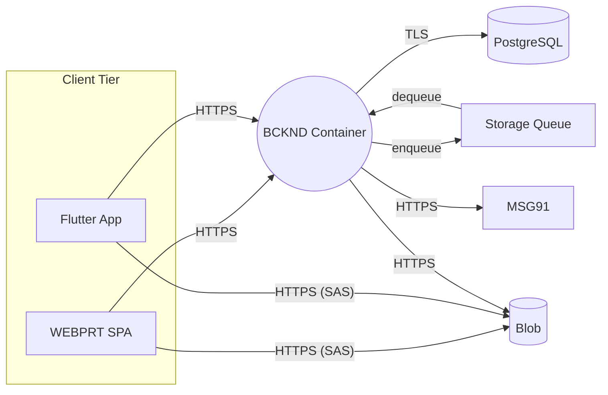
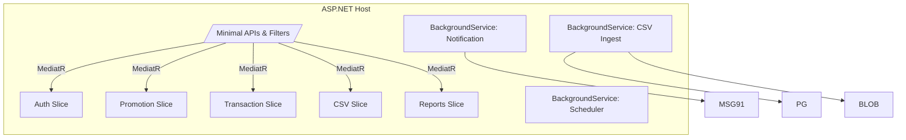
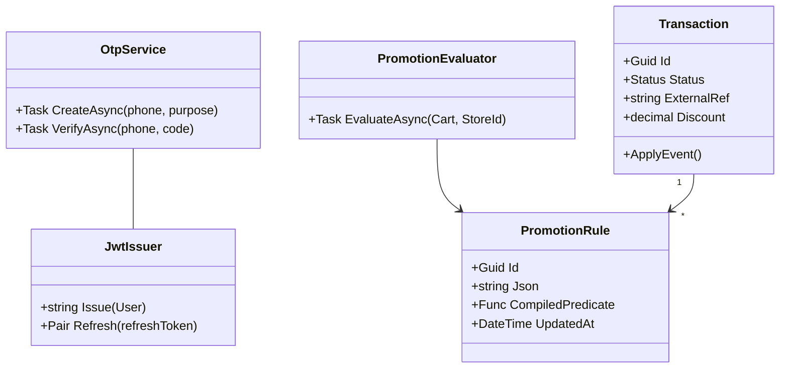
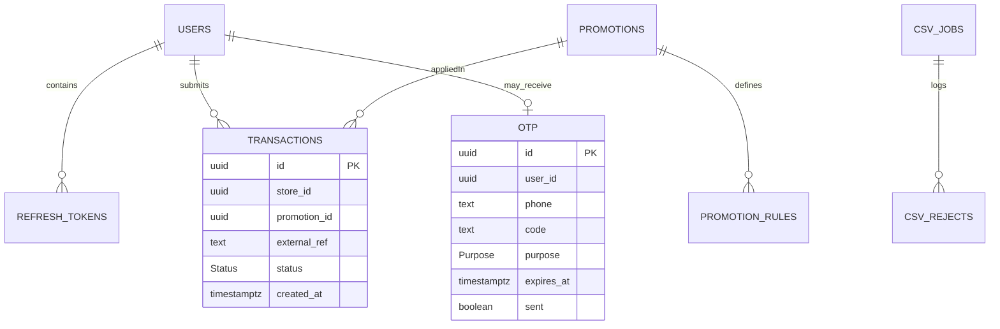
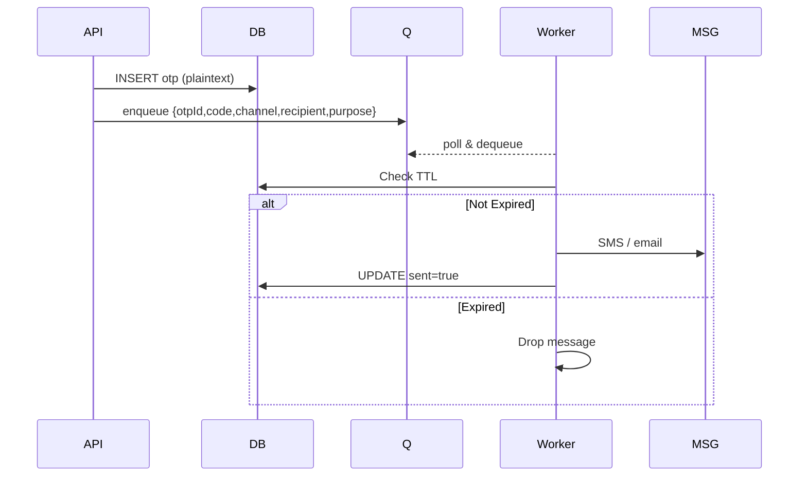
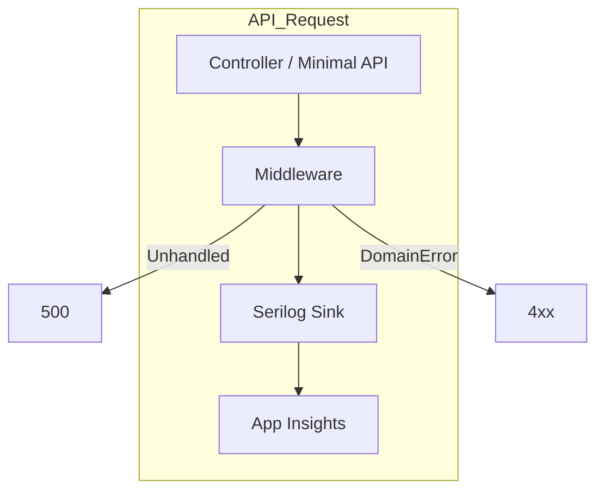

## L3-LLD-BCKND: Component-Specific Low-Level Design Document for BCKND

### 1. Component Context

The Backend (code: **BCKND**) is a .NET 8 modular-monolith running in a Linux container on **one** Azure App Service instance.  
It exposes the public REST contract consumed by the Web Portal (WEBPRT) and the Mobile App (APP), persists data to Azure PostgreSQL, streams files to Blob Storage, and performs background work (OTP dispatch, CSV ingest, scheduled jobs) inside the same host process.



NOTE 1 – Scaling Constraint: to avoid cluster-wide coordination for in-memory rate-limiter and cache, the App Service **instance count is pinned to 1** (vertical scaling only). Azure Portal autoscale rules are disabled.

---

### 2. Internal Architecture Overview  

This section describes how responsibilities are divided inside the single ASP.NET Host. Each feature "slice" is fully isolated and communicates through MediatR requests, ensuring low coupling while retaining monolithic deployment simplicity.

BCKND is organised as a single ASP.NET Core project that follows a **vertical-slice feature-folder** approach (Clarification #3 in client Q&A). Each slice owns its HTTP endpoints, command/handler pairs, validators, mapping profiles and EF DbContext extensions.



---

### 3. Module Descriptions  

The table below is followed by narrative paragraphs that give functional depth, typical invocation paths, error handling and cross-module touch-points so that developers can implement each module without opening other documents.

| Module | Responsibility | Key Tech |
|--------|----------------|----------|
| Auth Slice | OTP lifecycle, JWT issue/refresh, rate-limit | ASP.NET Identity-lite, System.IdentityModel.Tokens |
| Promotion Slice | CRUD, rule compilation cache, evaluation endpoint | System.Linq.Expressions, MemoryCache |
| Transaction Slice | FSM enforcement, idempotent create, reconciliation | PostgreSQL enum + triggers, EF ConcurrencyToken |
| CSV Slice | SAS generation, job registration, admin status | Azure.Storage.Blobs SDK |
| Reports Slice | Async export skeleton (CSV) | CsvHelper |
| Notification Worker | Dequeue OTP messages, call MSG91 | Azure.Storage.Queues, Polly |
| CSV Ingest Worker | Stream CSV, per-row validation, UPSERT | Npgsql COPY, SAVEPOINTs |
| Scheduler | Cron-style tasks (partition DDL, promo auto-archive) | Cronos |

Auth Slice   – Handles both login and customer-verification OTP flows. The slice exposes three endpoints (`/auth/otp/request`, `/auth/otp/verify`, `/auth/refresh`). A sliding-window rate-limiter (in-memory) guards `request`; verified codes transition to JWT issuance. Error paths: duplicate request within window → 429, code mismatch → 400, expired → 410.

Promotion Slice   – Stores promotions and associated JSON rule sets. On create/update it compiles rules into expression trees and places them in MemoryCache keyed by `promotionId|updatedAt`. When a promotion is patched, a cache invalidation event is published (in-proc) and the slice clears its local cache entry.

Transaction Slice   – Implements three-state flow (NEW → VERIFIED → COMPLETE) using a simple status field. Status changes require Admin role. Business guards live both in C# and SQL so that direct SQL tooling cannot violate transitions. KAM users are **read-only** on `status` per revised RBAC; only Admin can patch status.

CSV Slice   – For files <10MB: Direct synchronous processing via POST `/v1/csv-import/{entity}` with multipart upload, immediate validation and response. For files ≥10MB: Uses SAS URL async pattern (deferred to Phase 2).

Reports Slice   – Kicks off long-running CSV aggregations (performance, reconciliation). A job row with `status=PENDING` is created; the Scheduler picks it up and streams rows directly to Blob, then publishes a SAS URL.

Notification Worker   – Continuously polls the Storage Queue (5 s interval) for OTP messages, sends via MSG91, and marks `sent=true` in the DB within the same handler scope. Retries 3× with exponential back-off; poison messages move to `otp-poison`. Localization is out-of-scope for Phase 1; all messages are English-only.

Scheduler   – Runs Cron-expressions read from appsettings:  
• `0 0 1 * *`  – create next month's partitions for `transactions` **and `otp`**.  
• `0 0 * * *`  – auto-archive promotions whose end date elapses.  

---

### 4. Class & Relationship Diagram  

This diagram captures core domain aggregates and services; auxiliary DTOs and mapping profiles are omitted for brevity.



Relationship note – `OTP` rows optionally link to `USERS` (`user_id NULL`) because customer-verification OTPs may target phone numbers that are not yet registered users.

---

### 5. Database Schema  

The PostgreSQL schema is optimised for write-heavy OTP and transaction workloads while keeping cost and operational complexity low.

#### 5.1 ER Diagram (primary tables)



#### 5.2 Partitioning & Indexes  

Tables:  
• `transactions` – Regular table with standard B-tree indexes
• `otp` – Regular table with TTL-based cleanup (90 days retention)

Indexes:  
• `transactions_external_ref_store_uidx (store_id, external_ref)` UNIQUE
• `otp_phone_purpose_idx (phone, purpose)`
• `transactions_created_idx (created_at)` – for date-range queries

---

### 6. Core Logic Specifications

#### 6.1 Authentication & OTP Flow  

Queue payload now matches canonical schema `{ otpId, code, channel, recipient, purpose }`.

1. `POST /auth/otp/request` passes through sliding-window rate-limiter:
   - Login OTP: 5 requests/10 minutes per identifier, 6-digit code, 10-minute TTL, max 5 attempts within 10 minutes triggering 15-minute lockout, resend allowed 3 times per 15 minutes with 60s cooldown
   - Customer OTP: 3 requests/15 minutes per identifier, 6-digit code, 5-minute TTL, max 3 attempts triggering 15-minute lockout, resend allowed 3 times per 15 minutes with 60s cooldown
2. `OtpService.CreateAsync` inserts row (plaintext code stored without encryption), enqueues full payload to Queue.  
3. Worker polls Queue every **5 s** (Storage Queue lacks true long-poll) and sends via MSG91; drops message if code expired (TTL check); on success sets `sent=true`.  
4. `POST /auth/otp/verify` validates & consumes row, issues RS256 JWT signed with App-Service secret.  
5. User deactivation bumps `tokenVersion` → tokens instantly invalid.
6. Backend enforces lockout after failed attempts: 5 failures within 10 minutes for login OTP, 3 failures for customer OTP, both triggering 15-minute lockout window.



- For login OTP: System queries user record by phone, retrieves associated email (if exists), and queues identical OTP for both SMS and Email delivery via MSG91. The verification accepts the code regardless of which channel the user received it from.
- Queue TTL is set to match OTP TTL (10 minutes for login, 5 minutes for customer) ensuring expired codes are never delivered.

#### 6.2 Promotion Rule Engine  

Unchanged – see §3 narrative.

#### 6.3 Transaction FSM & Idempotency  

Unchanged except KAM is read-only – enforced by middleware role check.

#### 6.4 CSV Ingest  

Worker polls `csv_jobs` table (`status=PENDING`) instead of any queue; wording corrected.

### 6.5 Promotion Rule Engine Grammar Specification

The promotion engine uses a JSON-based DSL with IF-THEN structure. Rules are compiled to expression trees and cached in memory for performance.

#### Rule Structure

```json
{
  "conditions": { /* IF - when promotion applies */ },
  "actions": { /* THEN - benefit to apply */ },
  "constraints": { /* Optional limits */ }
}
```

#### Supported Conditions

- **Cart conditions**: `totalAmount`, `itemCount`, `items[].type`, `items[].category`
- **Store conditions**: `storeId`, `city`, `state`, `zone`, store group membership
- **Operators**: `equals`, `greaterThan`, `lessThan`, `contains`, `in`
- **Logical**: `all` (AND), `any` (OR), `not`

Example condition:

```json
{
  "conditions": {
    "all": [
      {"fact": "cart.totalAmount", "operator": "greaterThan", "value": 1000},
      {"fact": "cart.items[].type", "operator": "contains", "value": "LENS"}
    ]
  }
}
```

#### Supported Actions (v1)

1. **PERCENTAGE_DISCOUNT**: `{type: "PERCENTAGE_DISCOUNT", percentage: 20, maxDiscount: 500}`
2. **FIXED_DISCOUNT**: `{type: "FIXED_DISCOUNT", amount: 200}`

#### Constraints

- `requiresOTP`: boolean - requires customer verification
- `minimumCartValue`: number - minimum purchase amount
- `maxUsagePerCustomer`: number - usage limit per customer

#### Compilation & Caching

- Rules compiled to `Func<EvaluationContext, bool>` delegates on first use
- Cached with key `promotionId|updatedAt` in MemoryCache (200MB limit)
- Cache invalidated on promotion update
- Evaluation timeout: 5ms per rule

#### Validation

- JSON schema validation before storage (max 10KB per rule)
- Facts must exist in defined namespace
- Compiled SQL length ≤10,000 chars
- Test mode available via `/v1/promotions/evaluate?mode=test`

---

### 7. Minimal API Summary  

Full endpoint catalogue lives in L2-LLD-IC; this section provides frequently used endpoints with behavioural summaries for quick reference.

**Request Login OTP**  
Purpose: Requests a 6-digit OTP to be sent to the provided phone/email for login.  
Endpoint: `/v1/auth/otp/request`.  
Authorization Required: None.  
Methods: POST.  
Throttled at 5 req/min per identifier. System sends same OTP via both SMS and Email channels when both are registered.

**Verify OTP & Issue Tokens**  
Purpose: Verifies the OTP and issues JWT + refresh token pair.  
Endpoint: `/v1/auth/otp/verify`.  
Authorization Required: None.  
Methods: POST.  
Consumes the OTP row atomically. Returns RS256-signed JWT and refresh token on success.

**Evaluate Promotions**  
Purpose: Returns the list of promotions that the given cart and store qualify for.  
Endpoint: `/v1/promotions/evaluate`.  
Authorization Required: Bearer JWT with role A, S, or P.  
Methods: POST.  
Reads from in-memory compiled rule cache. Returns ordered list by estimated savings.

**Create Transaction**  
Purpose: Creates a new transaction in status `NEW`, applying the chosen promotion.  
Endpoint: `/v1/transactions`.  
Authorization Required: Bearer JWT with role S or P.  
Methods: POST.  
Idempotent on `(store_id, external_ref)`. Requires eligibility token when customer verification is enabled.

For the complete OpenAPI 3.1 file see GitHub artifact `promopartner-contracts/openapi/promopartner-v1.yaml`.

---

### 8. Performance Optimisations  

Connection pool size becomes configurable (`PG__MaxPoolSize`, default 30) to match B2ms limits. Queue polling interval set to 5 s; MemoryCache size capped at 200 MB.  

---

### 9. Security Design  

• **Transport** – TLS 1.2 for all public endpoints (App Service standard).  
Removed confusing "App Service front door" wording – the TLS terminates directly on **App Service public endpoint**.  
• **Secrets** – RSA private key, DB string, and MSG91 API key stored in encrypted App Service settings as per L1-KD; quarterly manual rotation with overlapping `kid`s.  
• **Data-at-Rest** – Azure server-side AES-256 for DB, Blob, Queue.  
• **HSTS** header max-age 180 days, includeSubdomains.  

Risk Note – Azure Key Vault is not used; this is an accepted deviation logged in Security Waiver SW-04-2025.

---

### 10. Error Handling & Logging  

The flowchart below visualises how exceptions propagate to the canonical envelope and logging sinks.



Poison OTP messages raise Serilog ERROR, are moved to `otp-poison`, and surface in an Azure Monitor alert.

---

### 11. Deployment & Configuration  

Deployment strategy aligned with L1-KD: **in-place update** of the single Production App Service – no staging slot or slot-swap.

Pipeline Steps:  

1. Push to `main` triggers build & unit tests.  
2. Docker image pushed to ACR.  
3. `az webapp config container set` updates Production slot.  
4. App Service restarts (~15 s). Downtime is acceptable within 5-min maintenance window.

---

### 12. Unit & Integration Testing  

| Module | Test Categories | Tools |
|--------|-----------------|-------|
| Auth | happy path, rate-limit, expired code | xUnit, Respawn |
| Promotions | rule compilation, cache invalidation | xUnit |
| Transactions | FSM transitions, idempotency, RBAC | xUnit, Testcontainers-Pg |
| CSV Ingest | schema validation, reject file generation | xUnit |
| Notification Worker | dequeue logic, retry, poison queue | xUnit, in-memory queue |

Coverage gate: 80 % lines, WARN on <70 % per module.

---

### 13. Cross-Component Interface Contract

This section defines the data contracts, event contracts, and error handling patterns that BCKND implements for integration with WEBPRT and APP components, maintaining clear traceability to L2-LLD-IC specifications.

#### 13.1 Data Contracts

The backend enforces strict validation rules on all incoming data to ensure consistency across the system. All REST endpoints accept and return JSON with `camelCase` field naming.

**Authentication Data Structures**

- OTP Request: `{ phone: string(10), email?: string }`
  - Validation: Phone must match `^[6-9]\d{9}$`, email RFC 5322
  - Headers: None required
- OTP Verify: `{ phone: string, email?: string, code: string(6) }`
  - Validation: Code exactly 6 digits, TTL enforcement (10 min login, 5 min customer)
  - Response: `{ jwt: string, refreshToken: string, userId: string, role: string }`

**Transaction Data Structures**

- Create Transaction: `{ cart: CartItem[], promotionId: uuid, eligibilityToken?: string, requestUuid: uuid }`
  - Size limit: 1 MB max payload
  - Validation: Valid promotion ID, unique requestUuid per store
  - Headers: `Authorization: Bearer <JWT>`, `X-Store-Id` (for Parent Users)
- Reconciliation Update: `{ invoiceNo: string(30), pidNo: string(30) }`
  - Validation: Unique(store_id, invoiceNo) AND Unique(store_id, pidNo)
  - Pattern: `[A-Za-z0-9-_]{1,30}`

**CSV Upload Contracts**

- SAS URL Request: `{ fileName: string, size: number }`
  - Size limit: 50 MB max file size
  - Response: `{ uploadUrl: string, expiresAt: datetime }`
- Register Job: `{ entity: string, blobUrl: string }`
  - Validation: Entity in ['products', 'stores', 'users']

**Pagination Format**

- Request: `?limit=N&nextToken=string`
  - Max limit: 100 items
- Response: `{ items: T[], nextToken?: string }`

#### 13.2 Event Contracts

The backend publishes events to Azure Storage Queue for asynchronous processing, primarily for notification delivery.

**OTP Queue Message Schema**

```json
{
  "otpId": "uuid",
  "code": "string(6)",
  "channel": "sms|email",
  "recipient": "string",
  "purpose": "login|customer"
}
```

- Queue TTL: 15 minutes (aligned with OTP TTL)
- Encryption: AES-256 at rest (Azure managed)
- Retry: 3 attempts with exponential backoff (2s, 4s, 8s)

#### 13.3 Error Handling Propagation

All errors follow the canonical envelope defined in L2-LLD-IC §6, ensuring consistent client-side handling.

**Error Categories and Codes**

- 400 Bad Request: `FIELD_REQUIRED`, `INVALID_FORMAT`
- 401 Unauthorized: `UNAUTHENTICATED`
- 403 Forbidden: `FORBIDDEN` (KAM attempting write operations)
- 409 Conflict: `STATUS_TRANSITION_INVALID`
- 429 Rate Limited: `RATE_LIMIT_EXCEEDED`, `ACCOUNT_LOCKED`
- 500 Internal Error: `UNEXPECTED_ERROR`

**Error Response Format**

```json
{
  "error": {
    "code": "ERROR_CODE",
    "message": "Human-readable message",
    "details": { "field": "value" }
  },
  "meta": { "traceId": "uuid" }
}
```

#### 13.4 Traceability to L2-LLD-IC

- REST endpoints: All paths prefixed with `/v1` as per L2-LLD-IC §4.1
- Authentication flow: Sequence diagrams in §5.1 and §5.2 of L2-LLD-IC
- File transfer: SAS-based upload flow detailed in L2-LLD-IC §5.4
- Error codes: Complete mapping in L2-LLD-IC §6

---

### 14. Inter-Component Communication Standards

This section establishes the communication standards that BCKND implements for integration with other components, aligned with system-wide standards from L1-HLD.

#### 14.1 API Standards

The backend maintains strict API versioning and compatibility rules to ensure stable client integrations.

**Version Management**

- Base path: All endpoints under `/v1` prefix
- Breaking changes: Require new base path (`/v2`) with 6-month overlap
- Non-breaking changes: Additive fields allowed within same version
- Deprecation: 90-day notice via `X-Deprecated` header

**HTTP Method Guidelines**

- GET: Idempotent queries, automatic retry allowed
- POST: State changes, no automatic retry
- PATCH: Partial updates (transactions, promotions)
- PUT: Full replacement (not used in current API)
- DELETE: Not implemented (per data retention policy)

**Rate Limiting Configurations**

- OTP Request: 5 requests/minute per identifier
- General API: 60 requests/minute per JWT
- CSV Upload: 10 concurrent jobs per tenant
- Headers: `X-RateLimit-Limit`, `X-RateLimit-Remaining`

#### 14.2 Security Standards

Authentication and authorization follow consistent patterns across all endpoints.

**Token Specifications**

- Algorithm: RS256 for JWT signing
- Access Token TTL: 60 minutes
- Refresh Token TTL: 12 hours
- Storage: HTTP-only cookies for WEBPRT, secure storage for APP
- Claims: `userId`, `role`, `storeIds[]`, `tokenVersion`

**Authorization Boundaries**

- Admin (A): Full CRUD on all resources
- KAM (K): Read-only access, HTTP 403 on write attempts
- Store User (S): Transaction creation, limited user management
- Parent Store User (P): Includes child store management

**Context Propagation**

- Trace ID: `X-Trace-Id` header for correlation
- Store Context: `X-Store-Id` for Parent Users
- Client Platform: `X-Client-Platform` (ios|android|web)

#### 14.3 Performance Requirements

The backend operates within defined performance budgets appropriate for the documented scale.

**Response Time Budgets**

- Authentication endpoints: <500ms P95
- Query endpoints: <800ms P95
- Transaction creation: <1000ms P95
- CSV processing: Async, status polling

**Resource Limits**

- Max request size: 1MB (JSON), 50MB (CSV)
- Connection pool: 30 connections (B2ms PostgreSQL limit)
- Memory cache: 200MB cap
- Concurrent CSV jobs: 1 (resource contention prevention)

#### 14.4 Asynchronous Communication

Queue-based messaging follows standardized patterns for reliability.

**Queue Configuration**

- Technology: Azure Storage Queue
- Polling interval: 5 seconds
- Message TTL: 15 minutes (OTP), 1 hour (reports)
- Poison queue: After 3 failed attempts

**Delivery Guarantees**

- At-least-once delivery
- No ordering guarantees
- Idempotent message processing
- Duplicate detection via message ID

#### 14.5 Monitoring Standards

Consistent monitoring enables operational visibility.

**Required Metrics**

- API latency by endpoint
- Error rate by status code
- Queue depth and processing lag
- Database connection pool usage

**Log Aggregation**

- Framework: Serilog → Application Insights
- Log levels: Debug (dev), Information (prod)
- Correlation: X-Trace-Id in all log entries
- PII redaction: OTP codes, passwords masked

---

_End of Document_
