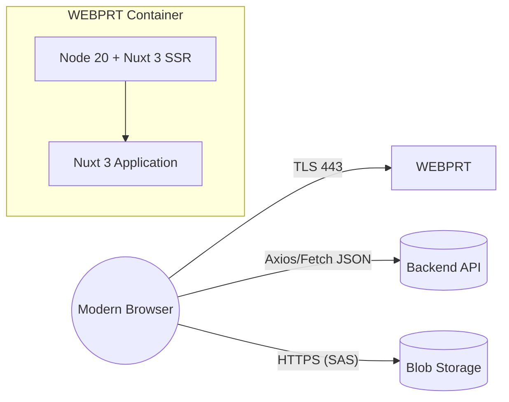
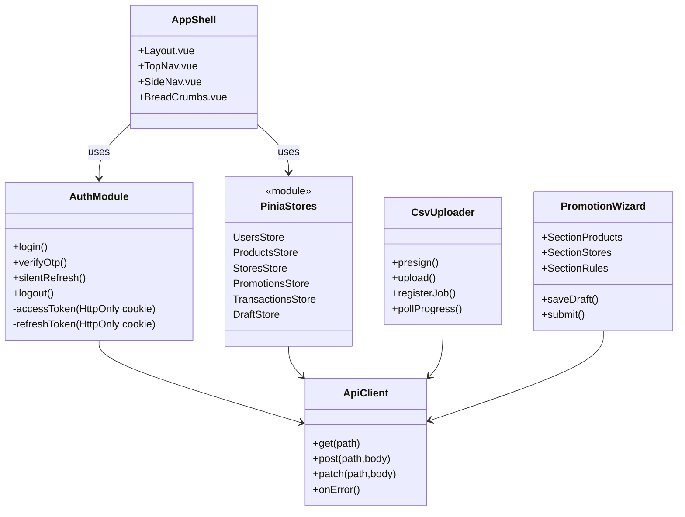
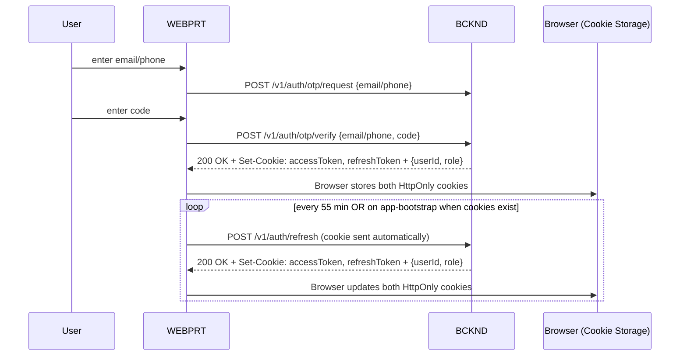
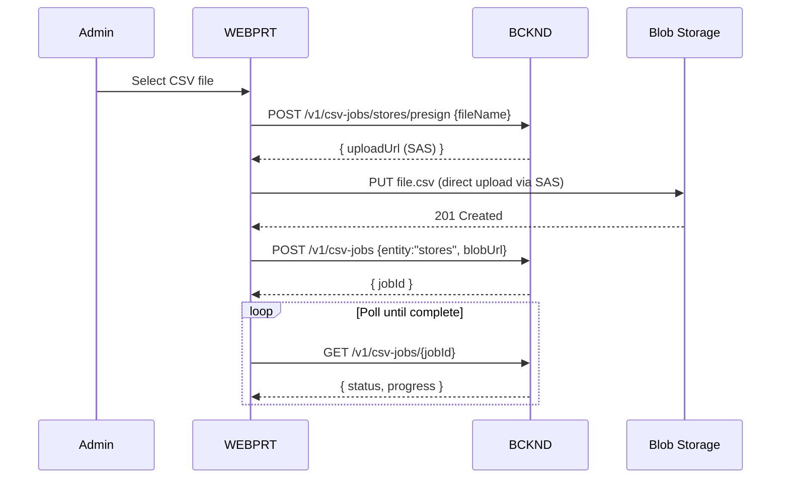
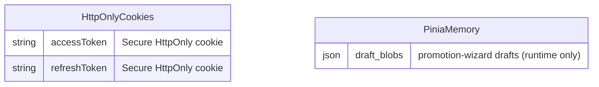
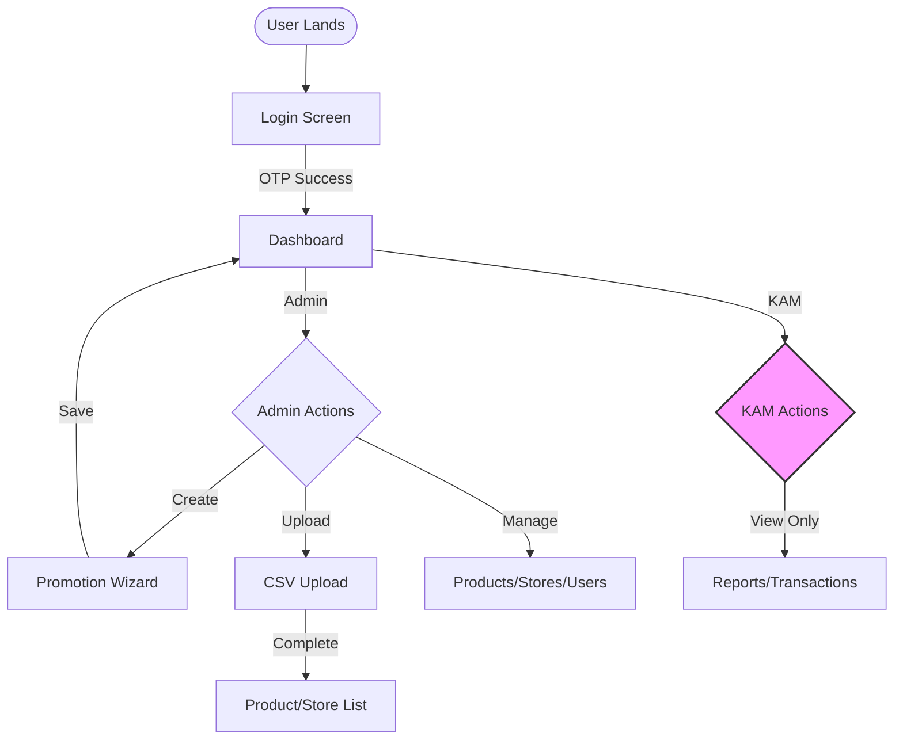
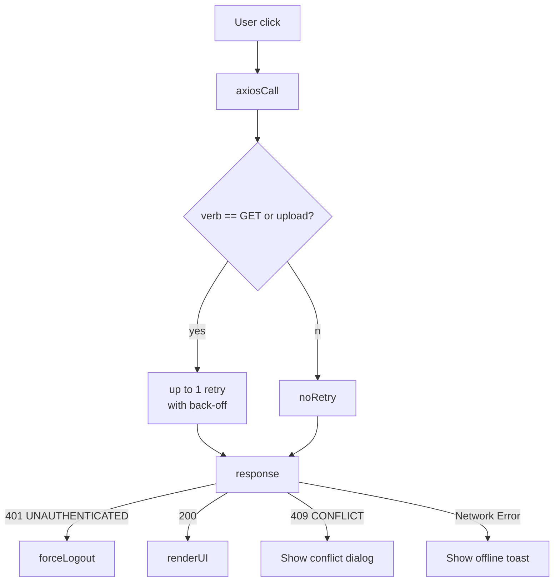

## L3-LLD-WEBPRT: Component-Specific Low-Level Design Document for WEBPRT  
PromoPartner – Essilor Luxottica Joint-Promotions Platform  

---

### 1  Component Context
WEBPRT is the browser-facing administration portal that enables Admin and KAM roles to maintain master-data, design promotions and reconcile transactions. It is the **only** human UI for back-office processes; Store and Parent-Store users interact exclusively through the mobile APP as per L1-SI §2.1.



   The Axios / Fetch calls originate **from the Browser**, not from the Node container, clarifying run-time boundaries.

‐ WEBPRT runs as a **Nuxt 3 SSR/universal mode application** inside a **Node 20** Docker image deployed to Azure App Service Linux container as per KD-WEBPRT-02.  
‐ It holds **zero server-side state**; all data are pulled from BCKND or streamed directly to Blob.

---

### 2  Design Drivers & Constraints  
The purpose of this section is to summarise the non-functional drivers that shaped the component design before listing the operative constraints.  
* Single-tenant, single-region, **low concurrency (Admin/KAM only)** aligned with back-office usage patterns.  
* Must respect office IP allow-list (Azure App Service Access Restrictions).  
* Bundle-size and performance budgets are _informational only_; no numeric SLOs mandated.  
* All business logic, validation and persistence live in BCKND; WEBPRT enforces only client-side UX rules.

---

### 3  High-Level Architecture

A dotted frame around the classes (omitted here for brevity) is used in the full-size PDF export to emphasise that the code executes in the browser context.

---

### 4  Module Descriptions
| Module | Responsibility | Key Tech / Notes |
|--------|----------------|------------------|
| App Shell | Global layout, routing, role-based menu generation | Nuxt pages & layouts, Tailwind CSS primitives |
| Auth Module | OTP login UI, token handling, silent refresh, logout | Both access-token and refresh-token managed via **HttpOnly cookies** set by backend as per KD-WEBPRT-03, automatically sent with credentials. |
| Api Client | Thin Axios wrapper: `baseUrl` env, automatic cookie credentials, canonical error envelope parsing | Centralised **retry limited to idempotent GETs and PUT file uploads**; all state-changing verbs are _never_ retried. |
| Pinia Stores | Normalised entity caches; provides getters for role-scoped filters | Each store invalidated on JWT refresh; includes DraftStore for promotion wizard drafts |
| CSV Uploader | Implements SAS upload flow; 50 MB limit, single `PUT` with progress | Feature-detects `ReadableStream`; falls back to `XMLHttpRequest` for Safari/legacy |
| Promotion Wizard | 5-section wizard form; drafts auto-saved to Pinia DraftStore every 5 s | FormKit, Zod client schema mirrors server DTO |

---

### 5  Key Interaction Sequences  

#### 5.1  Login & Silent Refresh

  
Both access token and refresh token are set by the backend via `Set-Cookie` headers with `HttpOnly`, `Secure`, and `SameSite=Strict` flags as per L3-KD-WEBPRT-03, preventing JavaScript access and enhancing security.

#### 5.2  CSV Upload (Stores Master Data)


---

### 6  Data & Local-Storage Model  
WEBPRT persists only HttpOnly cookies in the browser:  
1. Access-token – managed via HttpOnly cookie (set by backend, not accessible to JavaScript).  
2. Refresh-token – managed via HttpOnly cookie (set by backend, not accessible to JavaScript).  
3. Promotion-wizard drafts – stored in Pinia DraftStore (runtime memory only).  

No LocalStorage, SessionStorage, or IndexedDB is used per KD-WEBPRT-08; this minimises XSS impact while maintaining state through page reloads via server-side session recovery.



---

### 7  Algorithms & Logic Specifications
1. **Silent-Refresh Scheduler**  
   • A fixed interval timer refreshes tokens every 55 minutes via `setInterval`.  
   • At app bootstrap, the browser automatically sends HttpOnly cookies with the `/auth/refresh` request.  
   • Any 401/403 response with code `UNAUTHENTICATED` triggers `logout()`.

2. **Progressive CSV Upload**  
   • Capability detect `window.ReadableStream && request.upload`; choose stream or XHR path.  
   • Single automatic retry on transient network error; afterwards surfaces toast.  

3. **Paged Table Adapter** – 

4. **OTP Lockout Logic**  
   • Frontend displays lockout message when backend returns 429 with `ACCOUNT_LOCKED` error code.  
   • Lockout duration (15 minutes) displayed based on backend response headers.  
   • No client-side attempt counting; all lockout logic enforced by backend per L3-KD-WEBPRT-10.

5. **Draft Auto-Save Logic**  
   • Promotion wizard subscribes to form state changes.  
   • Debounced save to Pinia DraftStore every 5 seconds.  

---

### 8  Performance Optimisation  
This section outlines pragmatic client-side performance tactics appropriate for the stated low concurrency (Admin/KAM only) scale.  
* Automatic route-level code splitting (Nuxt dynamic imports).  
* Pre-compressed (`.br` and `.gz`) assets emitted by Nuxt build; Azure App Service serves appropriate encoding based on Accept-Encoding header.  
* Virtual-DOM memoisation for large tables via `<tbody v-once>` when dataset immutable.  
* External JS bundles (Azure SDK, charts) loaded via dynamic `import()` on first use.

---

### 9  Security Design Details
| Concern | Implementation |
|---------|----------------|
| Auth Tokens | Both access and refresh tokens stored in HttpOnly cookies per L3-KD-WEBPRT-03; JWT uses RS256 encryption. |
| CSRF | HttpOnly cookie with SameSite=Strict | CSRF | SameSite=Strict cookies provide primary CSRF protection by preventing cross-site request submission; backend Origin validation adds defense-in-depth. |
 CSRF; Origin + Referer headers validated server-side. |
| Transport | HTTPS enforced via App Service; TLS 1.2 minimum; HSTS 180 days preload. |
| IP Restriction | Azure Access Restrictions – CIDRs supplied by ELX IT (Admins/KAM routes only). |
| CSP | _Report-only_ header for first release; tightened after telemetry. |
| XSS | Tailwind + Vue template escaping; `v-html` banned by ESLint rule. |
| Role Enforcement | Routes guarded by meta `roles` array using user role returned from `/v1/auth/otp/verify` response; KAM users see read-only UI per L3-KD-WEBPRT-09. |
| Session Revocation | Middleware reacts to 401 with `UNAUTHENTICATED` and forces logout; aligns with L2 error-code catalogue. |
| WCAG Compliance | WCAG 2.1 AA compliance with aria-labels, keyboard navigation, and contrast ratios per L3-FRS-WEBPRT. |

---

### 10  Error Handling & Logging  
Each bullet is preceded by a rationale sentence to improve narrative flow.  
Client-side observability is required for production diagnostics.  
* Console errors and warnings are captured via custom error boundary for local debugging.
* Global Axios interceptor maps server envelope → toast + optional dialog.  
* Expected validation failures (`4xx`) show inline form errors; unexpected (`5xx`) yield error page with traceId.  
* Unhandled promise rejections funnel to `window.onunhandledrejection` → console.error with structured format.
* Log level toggled via `NUXT_PUBLIC_DEBUG=true` in `.env`.

#### Error Handling Matrix
Based on L3-FRS-WEBPRT FR-WEBPRT-21, the following client-side error handling is implemented:

| Error Code | HTTP Status | UI Behavior |
|------------|-------------|-------------|
| `FIELD_REQUIRED` | 400 | Inline field error, highlight missing field |
| `INVALID_FORMAT` | 422 | Inline validation message with format hint |
| `UNAUTHENTICATED` | 401 | Force logout, redirect to login |
| `FORBIDDEN` | 403 | Toast: "Access denied", disable action |
| `RATE_LIMIT_EXCEEDED` | 429 | Toast with retry-after duration |
| `ACCOUNT_LOCKED` | 429 | Modal with lockout duration |
| `RESOURCE_NOT_FOUND` | 404 | Redirect to listing page with toast |
| `UNEXPECTED_ERROR` | 500 | Error page with traceId |

---

### 11  API Specifications  
This section provides minimalist endpoint summaries aligned with component scope requirements, focusing on basic purpose, URL, methods, and authorization.


### 11  API Specifications  
This section provides minimalist endpoint summaries for WEBPRT's backend interactions, focusing on essential integration points without implementation details.

**Authentication Endpoints**
- Purpose: Request OTP for Admin/KAM login via SMS or email  
  Endpoint: `/v1/auth/otp/request`  
  Authorization Required: None  
  Methods: POST

- Purpose: Verify OTP and establish authenticated session  
  Endpoint: `/v1/auth/otp/verify`  
  Authorization Required: None  
  Methods: POST

- Purpose: Refresh expired access token using cookie-based refresh token  
  Endpoint: `/v1/auth/refresh`  
  Authorization Required: Valid refresh token  
  Methods: POST

**User Management**
- Purpose: List and filter system users with pagination  
  Endpoint: `/v1/users`  
  Authorization Required: Admin, KAM (read-only)  
  Methods: GET

- Purpose: Create or update user records  
  Endpoint: `/v1/users`  
  Authorization Required: Admin only  
  Methods: POST, PATCH

**Product Catalog**
- Purpose: Query product inventory with attribute filtering  
  Endpoint: `/v1/products`  
  Authorization Required: Admin, KAM (read-only)  
  Methods: GET

- Purpose: Manage individual product records by SKU  
  Endpoint: `/v1/products/{sku}`  
  Authorization Required: Admin only  
  Methods: GET, PUT, DELETE

**Store Management**
- Purpose: List stores with hierarchical relationships  
  Endpoint: `/v1/stores`  
  Authorization Required: Admin, KAM (read-only)  
  Methods: GET

**Promotion Management**
- Purpose: Query promotions filtered by status  
  Endpoint: `/v1/promotions`  
  Authorization Required: Admin, KAM (read-only)  
  Methods: GET

- Purpose: Create or modify promotion configurations  
  Endpoint: `/v1/promotions`  
  Authorization Required: Admin only  
  Methods: POST, PATCH

- Purpose: Test promotion rules without creating transactions  
  Endpoint: `/v1/promotions/evaluate?mode=test`  
  Authorization Required: Admin only  
  Methods: POST

**Transaction Operations**
- Purpose: View transaction history with reconciliation status  
  Endpoint: `/v1/transactions`  
  Authorization Required: Admin, KAM (read-only)  
  Methods: GET

**File Operations**
- Purpose: Obtain SAS URL for direct CSV upload to Blob Storage  
  Endpoint: `/v1/csv-jobs/{entity}/presign`  
  Authorization Required: Admin only  
  Methods: POST

- Purpose: Register uploaded file for backend processing  
  Endpoint: `/v1/csv-jobs`  
  Authorization Required: Admin only  
  Methods: POST

- Purpose: Monitor CSV import job progress  
  Endpoint: `/v1/csv-jobs/{id}`  
  Authorization Required: Admin only  
  Methods: GET

**Reporting**
- Purpose: Retrieve dashboard KPIs and operational metrics  
  Endpoint: `/v1/dashboard`  
  Authorization Required: Admin, KAM (read-only)  
  Methods: GET


_All endpoints share JSON envelopes and status-codes per L2 specification._

---

### 12  Deployment & Configuration
Deployment strategy aligns with L1-HLD specifications for single-region, production-only environment using in-place deployment during designated 5-minute maintenance windows.

**Infrastructure Setup:**
* Single Azure subscription hosting production environment only
* Azure App Service (Linux container) P1v2 plan for WEBPRT
* No slot/swap mechanism; all deployments are in-place
* Single region (Azure Central India) with no DR capability
* Platform relies solely on Azure PostgreSQL's built-in 7-day PITR backups

**CI/CD Pipeline:**
* Source control: GitHub repository (WEBPRT)
* Build: GitHub Actions with Docker build → push to Azure Container Registry (ACR)
* Deploy: `az webapp config container set` for in-place deployment
* Image tags follow git SHA pattern for rollback capability
* No pre-production environment provisioned

**Environment Variables (App Service Application Settings):**
```
API_BASE_URL             = https://api.promopartner.xxx/v1
OFFICE_CIDRS             = 123.45.0.0/16, 78.90.12.0/24
NUXT_PUBLIC_DEBUG        = ""
NODE_ENV                 = production
PORT                     = 8080
```
* No Azure Key Vault usage per key instructions
* Secrets stored as encrypted App Service settings
* Manual rotation during quarterly maintenance windows

---

### 13  Cross-Component Interface Contract Alignment  
WEBPRT consumes the generated OpenAPI 3.1 spec (`promopartner-v1.yaml`) via `openapi-typescript` to derive typed Axios clients. Request/response envelopes, pagination (`limit/offset ≤100`), and canonical error codes are verified at compile-time. Contract tests run `openapi-diff` against the spec on every PR; build fails on any incompatible change.

---

### 14  UI & UX Design
This section provides comprehensive UI/UX specifications adapted from L1-SI guidelines for the WEBPRT component, ensuring consistent back-office experience for Admin and KAM users. The design is based on the provided prototype with adjustments for PromoPartner requirements.

#### 14.1 Global Layout
The WEBPRT interface follows a standard admin dashboard pattern optimized for desktop usage:

```
┌─────────────────────────────────────────────────────────────┐
│ Header (60px)                                                │
│ ┌─────┬─────────────────────────────────────┬─────────────┐ │
│ │ Logo│ PromoPartner Admin Portal           │ User Menu   │ │
│ └─────┴─────────────────────────────────────┴─────────────┘ │
├───────────────┬─────────────────────────────────────────────┤
│ Sidebar       │ Main Content Area                           │
│ (240px)       │                                             │
│               │ ┌─────────────────────────────────────────┐ │
│ ├ Dashboard   │ │ Page Title                              │ │
│ ├ Promotions  │ └─────────────────────────────────────────┘ │
│ ├ Products    │                                             │
│ ├ Stores      │ [Page-specific content]                     │
│ ├ Users       │                                             │
│ └ Reports     │                                             │
│               │                                             │
└───────────────┴─────────────────────────────────────────────┘
```

**CSS Specifications from Prototype**:
- Header: Fixed position, height 60px, white background, box-shadow: 0 2px 4px rgba(0,0,0,0.1)
- Sidebar: Fixed position, width 240px, background #2c3e50, color white
- Content: margin-left 240px, margin-top 60px, padding 20px
- Font: -apple-system, BlinkMacSystemFont, 'Segoe UI', Roboto, sans-serif
- Background: #f5f7fa

**Responsiveness**: 
- Minimum supported width: 1024px (office workstations)
- No mobile optimization required (back-office only)
- Sidebar remains fixed (no collapse on smaller screens for Admin portal)

#### 14.2 Screen-Specific Layouts and Mockups

**Login Screen**
- Purpose: Single-factor OTP authentication
- Layout: Centered card (400px width) on gradient background
- Visual Design:
  - Background: linear-gradient(135deg, #667eea 0%, #764ba2 100%)
  - Card: white background, border-radius 12px, box-shadow 0 20px 40px rgba(0,0,0,0.1)
  - Padding: 40px
- Fields: 
  - Email/Phone input with placeholder "admin@essilor-luxottica.com"
  - OTP code input (6 digits, auto-focus) - appears after first submission
- Endpoints: 
  - `/v1/auth/otp/request` (on submit email/phone)
  - `/v1/auth/otp/verify` (on submit OTP)
- Validations:
  - Email: RFC 5322 format
  - Phone: Indian mobile (^[6-9]\d{9}$)
  - OTP: 6 numeric digits

**Dashboard Screen**
- Purpose: Overview metrics and quick actions
- Layout: Grid-based responsive layout
- Components:
  - Stat Cards: 
    - Grid: grid-template-columns: repeat(auto-fit, minmax(300px, 1fr))
    - Card styling: background white, padding 25px, border-radius 8px, box-shadow 0 2px 4px rgba(0,0,0,0.1)
    - Metrics shown: Active Promotions, Total Spend, Today's Transactions
  - Charts: 
    - Container: background white, padding 20px, border-radius 8px
    - Placeholder height: 300px for main chart, 200px for smaller charts
- Data Requirements:
  - Active promotions count
  - Today's transactions
  - Pending reconciliations
- Endpoint: `/v1/dashboard` (GET)
- Refresh: Auto-refresh every 60 seconds

**Promotion Wizard (5 steps)**
- Container: background white, border-radius 8px, box-shadow 0 2px 4px rgba(0,0,0,0.1), padding 30px
- Wizard Steps Indicator:
  - Horizontal progress with numbered circles (40px diameter)
  - Active step: background #667eea, color white
  - Completed step: background #27ae60, color white
  - Inactive step: background #ecf0f1, color #7f8c8d
  
- Step 1: Basic Information
  - Name input (100 char limit)
  - Start/End date pickers
  - Description textarea (3 rows)
  - Marketing banner upload (drag-drop zone with dashed border)
  
- Step 2: Promotion Type
  - Grid layout of type cards (200px min-width)
  - Card hover: translateY(-2px), border-color #667eea
  - Selected card: border-color #667eea, background #f3f4ff
  - Types: Fixed Price, % Discount, Bundle/BOGO, etc.
  
- Step 3: Configuration
  - Rule builder with condition groups
  - Background #f8f9fa for builder container
  - Condition rows: flex layout with 10px gap
  
- Step 4: Eligibility
  - Store selection tree (max-height 400px, overflow-y auto)
  - Additional rules checkboxes
  - OTP validity dropdown
  
- Step 5: Review
  - Summary display in #f8f9fa background box
  - Grouped sections for all configured data
  
- Save: Auto-save drafts to Pinia DraftStore every 5s
- Submit: `/v1/promotions` (POST/PATCH)

**Transactions Table**
- Purpose: View and filter transaction history
- Table Design:
  - Header row: background #f8f9fa, font-weight 600
  - Row hover: background #f8f9fa
  - Status badges: 
    - Active: background #d4edda, color #155724
    - Draft: background #fff3cd, color #856404
    - Inactive: background #f8d7da, color #721c24
- Features:
  - Search box (200px width)
  - Status filter dropdown
  - Date range picker
  - Pagination (100 rows/page)
- Endpoint: `/v1/transactions` (GET)
- KAM View: Read-only, no action buttons

**Users Management**
- Purpose: Manage Admin/KAM users
- Layout: Standard table with filter controls
- Features:
  - Role filter (Admin/KAM)
  - Search by name/email
  - Edit/Deactivate buttons (Admin only)
  - Last active timestamp
- No pending approvals section (Store users managed via APP)
- Endpoint: `/v1/users` (GET, POST, PATCH)

#### 14.3 User Interaction Flows



**Button Styles from Prototype**:
- Primary: background #667eea, color white, hover: #5a67d8, transform translateY(-1px)
- Secondary: background #ecf0f1, color #34495e, hover: #bdc3c7
- Success: background #27ae60, color white, hover: #229954
- All buttons: padding 12px 24px, border-radius 6px, font-weight 600, cursor pointer


The prototype HTML file serves as the visual reference for implementation, with the above specifications providing the technical requirements and API mappings.

Screens adhere to ELX corporate style-guide v2.2; only the Nuxt implementation specifics are captured here.

---

### 15  Inter-Component Communication Standards
* HTTP 1.1 keep-alive, JSON UTF-8.  
* Mandatory headers: `X-Trace-Id` (propagated from backend); authentication via automatic cookie transmission.
* Rate-limit headers (`X-RateLimit-Limit`, `X-RateLimit-Remaining`) surfaced to UI for future UX hints.  
* Versioning: WEBPRT only calls `/v1/*`; future breaking changes will move to `/v2/*` with a 6-month overlap window.

---

### 16  Distributed-Operations Requirements
This section details distributed operation patterns for WEBPRT's client-side state management and server synchronization, ensuring reliable operation despite network latency and concurrent access.



#### Transaction Patterns
- **Optimistic Updates**: Disabled for all write operations to maintain consistency
- **Conflict Resolution**: 409 responses show dialog with server state, user must refresh
- **Session Boundaries**: JWT refresh maintains transaction context across token renewal

#### State Management
- **Pinia Store Synchronization**: 
  - Triggered on: JWT refresh, route change, manual refresh
  - Debounced API calls (300ms) to prevent request storms
  - Cache TTL: 5 minutes for reference data, immediate for transactional data
- **Draft Persistence**: 
  - Promotion wizard drafts saved every 5s to Pinia DraftStore
  - Drafts are lost on page reload (memory-only storage per security requirements)
  - Cleared on successful submission or logout

#### Monitoring Requirements
- **Development Metrics** (console logging for debugging only):
  - Page load time (Navigation Timing API)
  - API errors and status codes
  - Failed authentication attempts
- **Trace Correlation**: 
  - X-Trace-Id propagated from backend responses
  - Included in all subsequent API calls
  - Displayed in error screens for support

---

### 17 Component-Level Unit Testing Plans

This section outlines the unit testing strategy for WEBPRT, ensuring critical paths maintain ≥80% coverage aligned with L1-TSD testing frameworks.

#### Testing Framework Stack
- **Vitest 1.0**: Test runner (faster than Jest for Vite-based projects)
- **@vue/test-utils 2.4**: Vue component testing
- **@pinia/testing**: Pinia store mocking
- **MSW 2.0**: API mocking for integration tests

#### Module Test Coverage

| Module | Critical Paths | Test Focus | Target Coverage |
|--------|---------------|------------|-----------------|
| AuthModule | login(), verifyOtp(), silentRefresh() | Token lifecycle, error states | 90% |
| ApiClient | Error handling, retry logic | Network failures, auth flows | 85% |
| CsvUploader | SAS flow, progress tracking | Upload states, retry behavior | 80% |
| PromotionWizard | Form validation, draft saving | Validation rules, auto-save | 85% |
| Pinia Stores | CRUD operations, filters | State mutations, getters | 80% |

#### Test Scenarios

**Authentication Tests**
```javascript
describe('AuthModule', () => {
  it('verifies subsequent API calls succeed after OTP verification')
  it('triggers silent refresh 5 min before expiry')
  it('forces logout on 401 UNAUTHENTICATED')
  it('respects 15-min lockout on ACCOUNT_LOCKED')
})
```

**CSV Upload Tests**
```javascript
describe('CsvUploader', () => {
  it('obtains SAS URL and uploads directly to Blob')
  it('registers job after successful upload')
  it('polls job status until completion')
  it('handles network errors with single retry')
})
```

**Component Tests**
```javascript
describe('PromotionWizard', () => {
  it('validates required fields before submission')
  it('auto-saves draft to Pinia every 5 seconds')
  it('prevents navigation with unsaved changes')
  it('enforces Admin-only access for submit')
})
```

#### CI Integration
- Tests run on every PR via GitHub Actions
- Coverage reports uploaded to Azure DevOps
- Build fails if coverage drops below 80% for critical paths
- E2E tests excluded from unit coverage metrics

---

### 18 Documentation and Coding Standards

This section defines WEBPRT-specific conventions that extend the enterprise standards from L1-HLD, ensuring consistent and maintainable code.

#### Code Conventions

**TypeScript/JavaScript**
- ESLint config: `@nuxt/eslint-config` with custom rules
- Naming: camelCase for variables/functions, PascalCase for components
- File structure: Feature-based organization (not type-based)
- Imports: Absolute paths via `@/` alias

**Vue Components**
- Composition API only (no Options API)
- Single-File Components with `<script setup>`
- Props: Explicit types with TypeScript interfaces
- Events: Typed with `defineEmits<{ eventName: [payload: Type] }>`

**CSS/Styling**
- Tailwind utility-first approach
- Component-specific styles in `<style scoped>`
- No inline styles except for dynamic values
- Dark mode: Not supported in Phase 1

#### Documentation Requirements

**Component Documentation**
```vue
<!--
  @component PromotionWizard
  @description Multi-step form for creating/editing promotions
  @roles Admin only
  @endpoints POST /v1/promotions, GET /v1/products, GET /v1/stores
-->
```

**Function Documentation**
```typescript
/**
 * Requests OTP for user authentication
 * @param channel - 'email' or 'sms' 
 * @param identifier - email address or phone number
 * @returns Promise<void>
 * @throws {ApiError} 429 if rate limited
 */
```

**API Client Methods**
- Document expected error codes
- Include example payloads
- Reference L2-LLD-IC endpoints

#### Git Conventions
- Branch naming: `feature/JIRA-123-description`
- Commit messages: Conventional Commits spec
- PR template: Includes testing checklist
- No direct commits to main branch

---

### 19 Compliance and Regulatory Requirements

While PromoPartner operates in a single-tenant, India-focused environment, WEBPRT implements specific compliance measures aligned with L1-NFRS requirements.

#### Data Privacy
- **PII Handling**: 
  - No PII stored in browser storage (per L3-KD-WEBPRT-08)
  - JWT contains only userId and role claims
  - Audit logs exclude sensitive data
- **Data Retention**: 
  - Session data cleared on logout
  - Draft data in Pinia memory cleared on logout
  - No client-side data persistence beyond session

#### Accessibility Compliance
- **WCAG 2.1 Level AA** (per L3-FRS-WEBPRT):
  - All interactive elements keyboard accessible
  - ARIA labels for screen readers
  - Color contrast ratio ≥4.5:1
  - Focus indicators visible
- **Testing**: 
  - Axe DevTools in development
  - Manual keyboard navigation tests
  - Screen reader compatibility (NVDA)

#### Security Compliance
- **OWASP Top 10 Mitigations**:
  - XSS: Content Security Policy, Vue auto-escaping
  - CSRF: SameSite cookies, state-changing via POST only
  - Injection: Parameterized API calls, no dynamic SQL
  - Sensitive Data: HTTPS only, HttpOnly cookies for tokens
- **Audit Trail**: 
  - All admin actions logged with timestamp and userId
  - Logs include before/after states for critical changes
  - Immutable audit trail via backend

#### Regulatory Requirements
- **GST Compliance**: Not applicable for WEBPRT (future APP feature)
- **DLT Compliance**: Handled by backend MSG91 integration
- **Data Localization**: All data remains in Azure Central India

---

_End of Document_