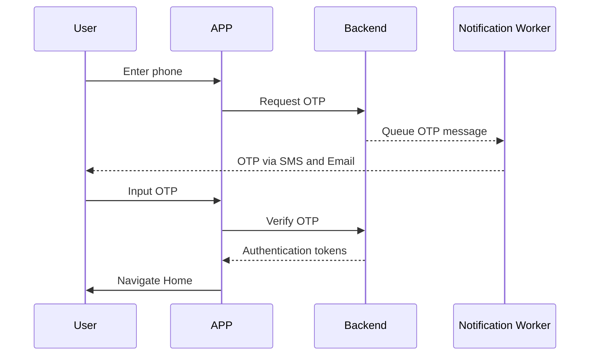
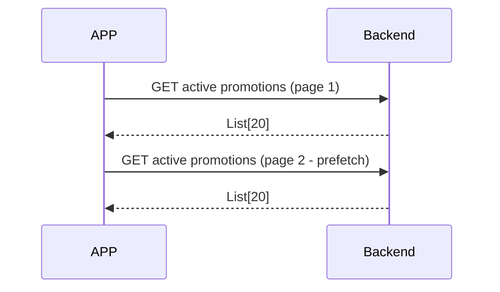
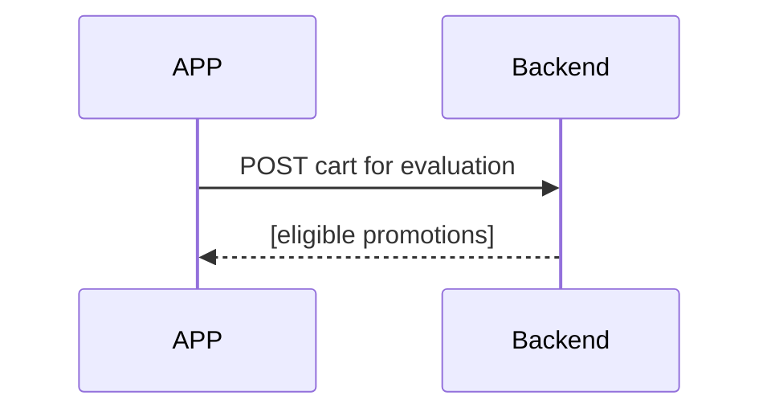
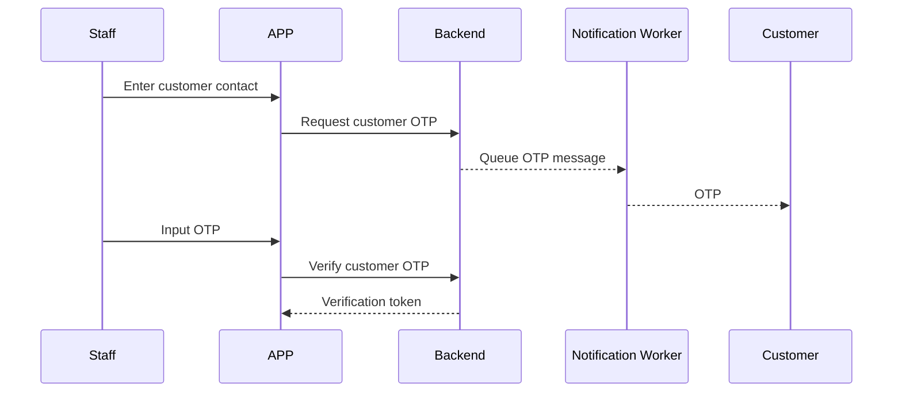
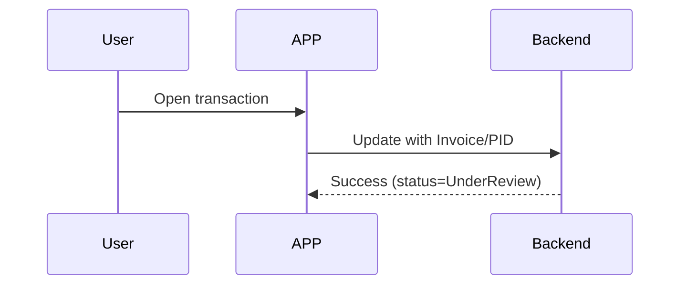
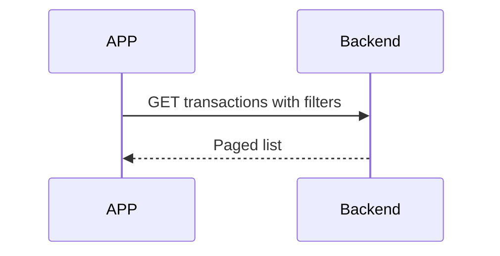
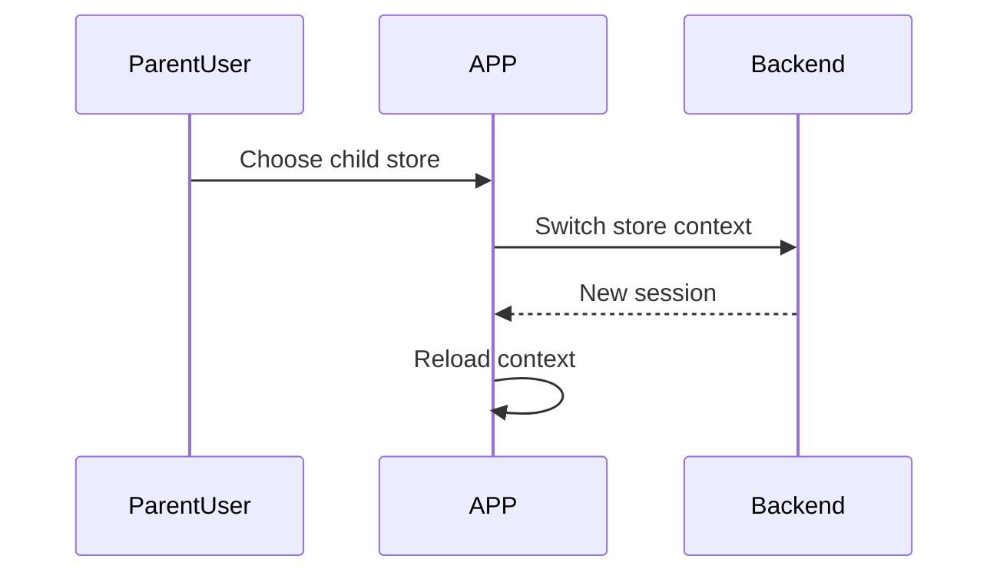
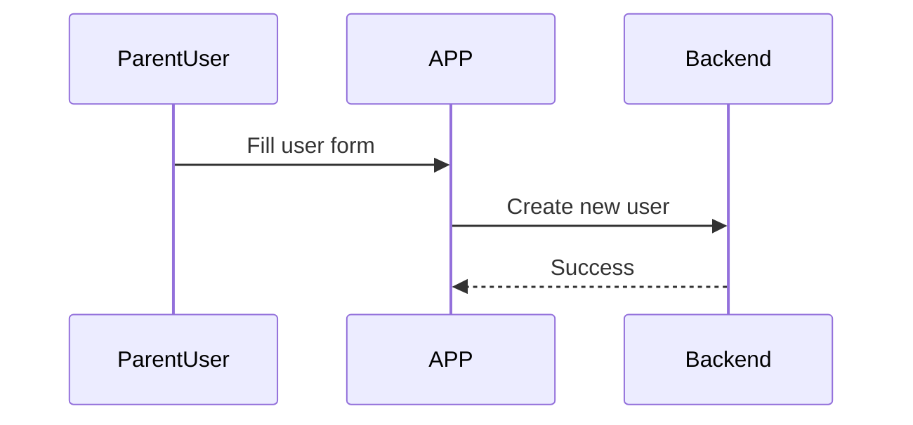

## L3-WF-APP: Workflow Details for APP: Cross-platform (Flutter) mobile client that lets Store AND Parent-Store Users submit customers purchase data, discovers and avails trade offers and perform reconciliation of promotion transactions. 

Intro  
This L3 document refines the APP workflows defined at L1, resolves all documented contradictions, and embeds previously "Clarification #1–#8" items inline for traceability. All functional choices remain strictly scoped to the 5 k-user / 20-promotion scale stated in L1; no extra-large-scale patterns are introduced. Note: No actual payment processing occurs within the solution - reconciliation refers only to promotion transaction verification through invoice/PID entry.

---

### 1. Component Scope
The APP is the primary in-store touch-point. It runs entirely online—no durable business data other than short-lived auth tokens is cached on-device—and invokes backend REST APIs for every business operation.

---

### 2. Actors & Preconditions

| Actor               | Credentials / Identifier          | Device / Channel Preconditions                    |
| ------------------- | --------------------------------- | ------------------------------------------------- |
| Store User          | Phone number provisioned by Admin | iOS 12+ / Android 8+, Internet reachable          |
| Parent Store User   | Phone number provisioned by Admin | Same as Store User                                |

*Admin and KAM users use only the Web Portal; they never authenticate on the APP.*

---

### 3. Architectural Assumptions

Key workflow assumptions for the APP include:

1. **Always Online**: Users must have active internet connection. If network is unavailable, users see "Offline" message and cannot proceed with any actions.
2. **Server-side Processing**: All business logic including promotion eligibility runs on the server, not in the APP.
3. **Reconciliation Fields**: Invoice and PID numbers can only contain letters, numbers, hyphens and underscores (max 30 characters).
4. **Parent Store Capabilities**: Parent Store users can create and manage child stores and their users directly from the APP.

---

### 4. Workflow Catalogue

Each numbered item starts with one or two contextual sentences followed by the detailed steps and at least one Mermaid diagram.

1. Authentication, Session Refresh & Logout  
2. Home & Promotion Feed  
3. Offer Transaction (Product → Eligibility → OTP → Completion)  
4. Reconciliation  
5. History Log  
6. Parent-Store Extended Operations  
7. Generic Error & Network Handling  

---

### 5. Authentication, Session Refresh & Logout

#### 5.1 Login (OTP)

Store and Parent-Store users login using their phone number as the primary identifier. Upon login request, the same OTP is sent to both the phone number (via SMS) and email address (if registered in user profile), providing dual-channel delivery for reliability, providing dual-channel delivery for added reliability.

1. User enters phone number.  
2. APP requests OTP from backend.  
3. Backend → internal Notification Worker process → MSG91 (SMS and Email).  
4. User inputs OTP (received via either SMS or Email) → APP verifies with backend.  
5. Backend returns authentication tokens; APP stores tokens securely.  
6. Navigate to Home.  

• Invalid OTP: after 5 failed attempts in 10 minutes the backend locks the account and the user must wait 15 min.  
• Resend: maximum 3 resends per 15 min window. The app will use the same OTP service rather than calling a new API.

#### 5.2 Silent Refresh
The APP automatically refreshes authentication tokens before they expire. If refresh fails, the user is returned to the login screen.

#### 5.3 Logout
1. User taps *Logout* in Profile.  
2. APP calls logout API (best-effort; ignored if offline).  
3. Local session cleared.  
4. Navigation stack cleared → Login screen.  

---

### 6. Home & Promotion Feed

The Home screen provides a paginated, store-filtered list of all *Active* promotions. It is the entry point for daily operations.

1. APP fetches active promotions for user's store (page size = 20).  
2. Infinite scroll prefetches next page at 80 % threshold.  
3. Tap on a card starts Offer workflow with `promotion_id` pre-selected (optional).  

---

### 7. Offer Transaction Workflow

This workflow mirrors an in-store POS interaction from product lookup to payment-ready transaction.

#### 7.1 Product Selection

*Goal*: Build a cart of SKUs with quantities and discover any applicable promotions.

1. User selects Product category - Frames/Lens 
If frames : A catalog style product listing page with Frames sku names and mrp appears. User can smart search with sku code. Any product added to cart gives option to add  - another product / select offer 
If lens  : a nested filter driven product(lens) selection. User chooses LENS ATTRIBUTES FROM DROPDOWNS lens.{fields} TO filter sous. ANY SKU ADDED TO CART gives option to add  - another product / select offer 

2. APP searches products (server-side tokenised search).  
3. User chooses result → quantity picker.  
4. APP keeps in-memory cart with selected products.
5. When cart is ready, user taps **Check Offers** which transitions to 7.2.  

* Duplicate SKUs merge quantities; cart max = 50 lines (prevent accidental bulk scans).
* Add another product lets user to go back to step 1 (he can choose frame or lens category)
#### 7.2 Offer Discovery

*Goal*: Tell staff which promotions the cart currently qualifies for.

1. APP assembles cart details with store ID.  
2. Backend evaluates eligible promotions and returns ordered list of applicable offers with estimated savings.  
3. UI shows savings badges; if multiple promos eligible user chooses one, else APP auto-selects highest savings.  
4. If customer verification required continue to 7.3, else skip to 7.4.  

#### 7.3 Customer Verification (OTP)

Customer verification ensures the promotion is applied to the intended recipient. Customers can receive OTP via SMS or Email based on their preference.

1. APP collects customer phone number or email.  
2. Request customer OTP with SMS/Email flag.  
3. Customer receives OTP → staff inputs.  
4. Verify customer OTP → returns verification token (expires per config).  
5. Resend allowed max = 3; invalid OTP after 5 attempts in 10 minutes locks flow for 15 min .  

#### 7.4 Transaction Submit

1. APP assembles transaction details with selected promotion and verification token if applicable.   
2. Submit transaction (idempotent by unique request ID).  
3. On success show receipt screen and reset cart; on duplicate request show "already processed" banner based on request ID.  

---

### 8. Reconciliation Workflow

Purpose: let Store or Parent-Store users supply statutory identifiers (Invoice & PID) so Admins can verify and settle the promotion spend.

#### 8.1 Pending List

1. Menu → **Reconciliation** lists transactions where status is New or Under Review scoped to current store.  
2. APP fetches pending transactions (page size = 25).  
3. Rows show colour chips: *Grey* = New, *Amber* = UnderReview.  
4. Search bar filters by Invoice/PID substrings.

#### 8.2 Edit & Save

Users can enter Invoice and PID numbers using letters, numbers, hyphens and underscores (max 30 characters each).

1. Tap row → detail sheet; if status is New or Under Review fields are editable.  
2. On **Save** → update transaction with Invoice and PID numbers.  
3. Backend transitions status:  
   • **New → UnderReview** (when at least one field filled)  
   • **UnderReview** remains; values overwrite previous ones (audit logged).  
4. **Uniqueness check** on Invoice and PID per store is executed **here**; duplicates return error message.  
5. Once Admin sets **Verified**, APP receives read-only fields.  

---

### 9. History Log

The History tab offers read-only access to all past transactions for the selected store.

Filters: date range (quick-pick 7 / 30 / 90 days), status, promotion, invoice #.

---

### 10. Parent-Store Extended Operations

Parent-Store users can maintain their retail network directly from the APP.

#### 10.1 Store Switch

*Goal*: operate on behalf of a child store without logging out.

1. FAB **Switch Store** lists child stores .  
2. Selecting store → switches context to selected store.  
3. Backend validates permissions, returns new session scoped to selected store.  
4. APP replaces session and broadcasts event so Home / Reconciliation reload in new context.  

#### 10.2 Create Child Store Wizard

Parent users fill a form with mandatory store information including name, type, zone, location details, and tax identifiers.

#### 10.3 Create Store User

1. Wizard collects: user's full name, phone number, and assigns them to the store.  
2. Create new user → backend creates user who can login using standard OTP flow.  
3. UI shows success toast and returns to User List.  
4. Deactivate / Reactivate flows: update user status.  

---

### 11. Generic Error & Network Handling

This section describes how the APP reacts to  transient network loss while honouring the **online-only** constraint—no background write queues or local data persistence are implemented.

  
#### 11.1 Common Error Scenarios

When users encounter errors, the APP displays appropriate messages:

- **Network Offline**: "No internet connection. Please check your network."
- **Session Expired**: User returned to login screen
- **Access Denied**: "You don't have permission to perform this action."
- **Duplicate Entry**: "This invoice/PID is already in use."
- **OTP Lockout**: "Too many attempts. Please wait 15 minutes."
- **Server Error**: "Service unavailable. Please try again later."

---

**End of document**