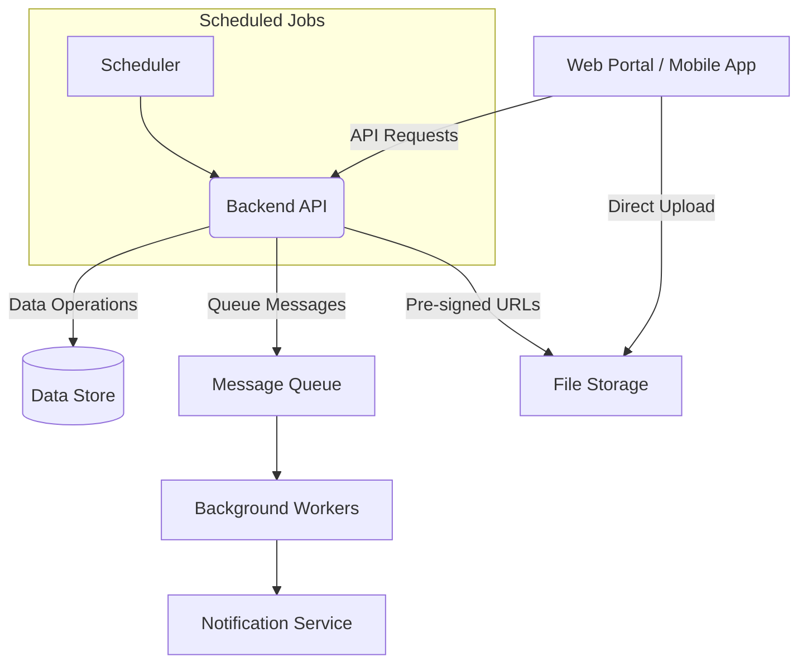

## L3-WF-BCKND: Workflow Details for BCKND  
Backend API and processing engine that executes promotion rules and orchestrates asynchronous jobs.

This document describes how the BCKND component fulfils every business-rule and data-persistence requirement for PromoPartner. Each section begins with short context, followed by the detailed workflow that engineers must implement.

---

### 1. Component Scope & Responsibilities  

BCKND is the central processing engine that exposes API endpoints under `/v1/**`, executes promotion-rule logic, orchestrates asynchronous jobs (data import, notification dispatch, daily schedulers) and is the sole source-of-truth for all persistable data. It handles "Paused" and "Archived" promotion states and distinct customer-OTP flows.

Primary duties  
• API façade for Web Portal (WEBPRT) and Mobile App (APP)  
• Authentication and session token issuance after OTP verification (all users receive both email and SMS channels)  
• Customer-verification OTP issuance and validation (SMS and Email, 5-minute validity)  
• Promotion rule compilation, eligibility evaluation and status scheduling  
• Transaction life-cycle management with idempotency and state-machine enforcement  
• Bulk data import for master data and reconciliation updates  
• Notification dispatch for OTP and transactional messages via asynchronous queue processing 
• Structured audit logging with immutable retention  
• Storage of both authoring-time rule definitions and compiled execution logic  

---

### 2. Actors & External Systems  

• APP ⇄ BCKND – Mobile app requests for promotion discovery, OTP flows, transaction creation  
• WEBPRT ⇄ BCKND – Web portal requests for admin/KAM operations (KAM read-only), bulk data import, promotion design, reconciliation  
• External Notification Service – SMS and Email delivery for OTP and transactional messages  
• File Storage – Document uploads, marketing assets, error reports  
• Data Store – Persistent storage for all business entities

---

### 3. High-Level Interaction Overview  

The backend processes synchronous API requests from clients, manages persistent data storage, queues asynchronous tasks for processing, and coordinates scheduled jobs. All file uploads use pre-signed URLs for direct client-to-storage transfer, with the backend managing metadata and processing.

---

## 4. Detailed Workflows  

### 4.1 Authentication & Session Management  

Two independent OTP flows exist: one for user-login (10-minute validity) and one for customer-verification during in-store redemption (5-minute validity). They share storage patterns but differ in validity period and retry limits.

#### 4.1.1 Login-OTP Generation & Delivery  

**Endpoint**: `POST /v1/auth/otp/request`  
**Input**: User's phone number  
**Process**:
1. Validate phone number format (10 digits)
2. Check if user exists and is active
3. Lookup user's registered email address from profile
4. Generate single 6-digit numeric OTP code
5. Queue same OTP for SMS delivery (always) AND email delivery (if email exists in profile)
**Business Rules**:
- OTP remains valid for 10 minutes from generation
- OTP sent to phone number always, email if available in user profile
- Maximum 3 resend requests per 15-minute window
- Phone number is the primary identifier for login

#### 4.1.2 Login-OTP Verification & Token Issuance  

**Endpoint**: `POST /v1/auth/otp/verify`  
**Input**: OTP identifier and entered OTP code  
**Process**:
1. Retrieve stored OTP record
2. Validate OTP has not expired
3. Compare entered code with stored code
4. If match:
   - Mark OTP as consumed
   - Generate authentication token (60-minute validity)
   - Generate refresh token (12-hour validity)
   - Return tokens based on client type (cookie for web, response body for mobile)
5. If no match:
   - Increment failure counter
   - Check if lockout threshold reached

**Business Rules**:
- After 5 failed attempts within 10 minutes, lock account for 15 minutes
- OTP can only be used once
- Expired OTPs cannot be verified

#### 4.1.3 Token Refresh  

**Endpoint**: `POST /v1/auth/refresh`  
**Input**: Refresh token  
**Process**:
1. Validate refresh token exists and hasn't expired
2. Generate new authentication token
3. Return new token

**Business Rules**:
- Refresh tokens expire after 12 hours
- Invalid tokens return 401 Unauthorized

#### 4.1.4 Customer-Verification OTP Generation  

**Endpoint**: `POST /v1/promotions/{id}/request-cust-otp`  
**Input**: Promotion ID, customer phone number (optional), customer email (optional), delivery channel flag  
**Process**:
1. Validate promotion exists and is active
2. Validate at least one contact method provided (phone or email)
3. Generate 6-digit OTP
4. Store OTP with 5-minute expiry
5. Queue notifications based on provided contact methods:
   - If phone provided: send SMS
   - If email provided: send email
   - If both provided: send to both channels
6. Return success response with delivery channel indicator

**Business Rules**:
- Customer OTP valid for 5 minutes only
- Maximum 3 verification attempts allowed
- At least one contact method (phone or email) required
- OTP sent only to provided channel(s)

#### 4.1.5 Customer-OTP Verification  

**Endpoint**: `POST /v1/promotions/{id}/verify-cust-otp`  
**Input**: Promotion ID, OTP code  
**Process**:
1. Validate OTP and promotion
2. If valid, generate verification token for transaction creation
3. If invalid after 5 attempts, lock flow (423 Locked)

**Business Rules**:
- 3 wrong attempts trigger lockout
- Verification token required for transaction submission

---

### 4.2 Promotion Configuration Workflows  

Promotions follow a defined lifecycle: Draft → Scheduled/Active → Paused → Archived. Each status has specific allowed transitions and business rules.

#### 4.2.1 Save / Activate Promotion  

**Endpoint**: `PUT /v1/promotions/{id}/activate`  
**Input**: Promotion ID  
**Process**:
1. Validate promotion is in Draft status
2. Resolve store group filters to actual store list
3. Resolve product group filters to actual product list
4. Compile promotion rules into executable format
5. If start date is future, set status to Scheduled
6. If start date is today or past, set status to Active
7. Store compiled rules for fast evaluation
8. Log audit event

**Business Rules**:
- Only Draft promotions can be activated
- All required fields must be complete
- Date ranges must be valid (end date after start date)
- Maximum 20 concurrent active promotions

#### 4.2.2 Scheduled Status Transition  

**Process** (runs daily at configured time):
1. Find all Active promotions where end date has passed
2. Update their status to Archived
3. Find all Scheduled promotions where start date is today or passed
4. Update their status to Active

**Business Rules**:
- Automatic archival when promotion ends
- Automatic activation when scheduled date arrives
- No manual intervention required for date-based transitions

#### 4.2.3 Pause and Resume Operations

**Pause Endpoint**: `PUT /v1/promotions/{id}/pause`  
**Resume Endpoint**: `PUT /v1/promotions/{id}/resume`  
**Process**:
- Pause: Change Active promotion to Paused status
- Resume: Change Paused promotion back to Active status

**Business Rules**:
- Only Active promotions can be paused
- Only Paused promotions can be resumed
- Paused promotions are excluded from eligibility checks

---

### 4.3 Promotion Eligibility Evaluation  

**Endpoint**: `POST /v1/promotions/evaluate`  
**Input**: Store ID, cart items (SKUs and quantities), optional customer identifier  
**Process**:
1. Load all Active promotions for the store
2. For each promotion:
   - Check if store is in promotion's store group
   - Evaluate cart against promotion rules
   - Calculate potential savings
3. Sort eligible promotions by savings amount
4. Return ordered list of applicable promotions

**Business Rules**:
- Only Active promotions are evaluated
- Store must be in promotion's store group
- Cart must meet all promotion conditions
- Higher savings promotions ranked first

#### 4.3.1 Test Console Evaluation

**Endpoint**: Same as regular evaluation  
**Input**: Lens field selections, frame field selections, store group  
**Process**:
1. Convert field selections to SKU list
2. Run standard evaluation logic
3. Return detailed breakdown for testing

**Business Rules**:
- Test mode uses same evaluation engine
- Results include detailed rule matching information

---

### 4.4 Transaction Creation Workflow  

**Endpoint**: `POST /v1/transactions`  
**Input**: Request UUID (for idempotency), promotion ID, cart details, customer information  
**Process**:
1. Check if request UUID already processed
2. If new:
   - Validate promotion still active
   - Apply promotion calculations
   - Create transaction record with status "New"
   - Queue confirmation notification
   - Return transaction ID (201 Created)
3. If duplicate:
   - Return existing transaction (409 Duplicate)

**Business Rules**:
- Each request UUID can only create one transaction
- Transaction amount calculations are final at creation
- Initial status always "New"
- Confirmation sent to customer via SMS and email

---

### 4.5 Reconciliation Status Update  

**Endpoint**: `PATCH /v1/transactions/{id}`  
**Input**: Transaction ID, invoice number, PID number  
**Process**:
1. Validate transaction exists and user has permission
2. Check current status allows update (New or UnderReview)
3. Validate invoice/PID format (alphanumeric, max 30 chars)
4. Check uniqueness within store
5. Update fields and transition status if needed
6. Log audit trail

**Business Rules**:
- Status progression: New → UnderReview → Verified → Settlement Complete
- Invoice/PID must be unique per store
- Only Store/Parent Store users can add invoice/PID
- Only Admin can set Verified or Settlement Complete status

---

### 4.6 Bulk Data Import Workflows  

#### 4.6.1 Master-Data Import  

**Endpoints**: 
- `GET /v1/csv-jobs/{entity}/sas-url` - Get upload URL
- `POST /v1/csv-jobs/{entity}/register` - Register uploaded file

**Process**:
1. Client requests pre-signed upload URL
2. Client uploads file directly to storage
3. Client registers upload with backend
4. Background worker processes file:
   - Validate format and mandatory fields
   - For each row:
     - If SKU exists: update record
     - If new: create record
     - If invalid: add to error report
5. Generate summary report
6. Send completion notification via email

**Business Rules**:
- File size limit: 50 MB
- SKU uniqueness enforced
- Duplicate SKUs in same file rejected
- Partial success allowed (valid rows processed)

#### 4.6.2 Bulk Transaction Reconciliation Update

**Process**:
1. Parse CSV with transaction IDs and updates
2. For each row:
   - Validate transaction exists
   - Apply status transition rules
   - Update invoice/PID if provided
3. Generate error report for invalid rows
4. Send summary notification

**Business Rules**:
- Must follow valid status transitions
- Invoice/PID uniqueness enforced
- Admin-only operation

---

### 4.7 Notification Dispatch  

**Process**:
Background workers process queued notifications:
1. Dequeue message
2. Extract notification details
3. For OTP: send code via SMS and email
4. For transactional: send confirmation via SMS and email
5. Log delivery attempt

**Business Rules**:
- All users receive both SMS and email
- OTP messages include the actual code
- Transactional messages include reference IDs
- Failed deliveries retry with backoff

---

### 4.8 Group Materialisation Workflow  

**Process**:
Groups are resolved to actual entity lists when needed:
1. Parse filter expression
2. Query matching entities based on attributes
3. Cache resolved list for performance
4. Invalidate cache when underlying data changes

**Business Rules**:
- Store groups filter by: City, PinCode, State, Zone, DoorType, ServiceType, EL360, EE, LIS
- Product groups filter by lens and frame attributes
- Groups are dynamic - membership updates automatically

---

### 4.9 Audit Logging  

**Process**:
All significant events are logged:
1. Capture event details (who, what, when)
2. Serialize to structured format
3. Write to immutable audit storage
4. Organize by date hierarchy

**Business Rules**:
- All write operations logged
- Logs cannot be modified or deleted
- Indefinite retention period
- Include user context and timestamps

### 4.10 Access Control and Validation Rules

**Role-Based Access**:
- Admin: Full read-write access to all endpoints
- KAM: Read-only access, no PUT/PATCH/DELETE operations
- Store User: Limited to own store transactions
- Parent Store User: Access to parent and child stores

**Common Validations**:
- Phone numbers: 10 digits
- Email: Standard email format
- Dates: End date must be after start date
- Status transitions: Must follow defined state machine
- SKUs: Must exist in master data
- Amounts: Non-negative values only

---

## 5. Integration-Point Summary  

| Concern                | Description                                       |
| ---------------------- | ----------------------------------------------- |
| Data Operations       | Persistent storage for all entities                |
| File Operations           | Pre-signed URLs for direct uploads, immutable audit logs     |
| Message Queue        | Asynchronous task processing            |
| External Notifications    | SMS and Email delivery service                               |

---

### 6. Failure Handling & Observability  

**Error Response Format**:
- Structured error responses with trace identifiers
- Clear error messages for validation failures
- HTTP status codes follow REST conventions

**Resilience Patterns**:
- Circuit breaker for external service calls
- Retry with exponential backoff for transient failures
- Request idempotency for critical operations
- Health check endpoint at `/healthz`

**Audit and Monitoring**:
- All operations logged with trace IDs
- Performance metrics tracked
- Failed OTP attempts monitored for security
- Account lockout after 5 failed attempts in 10 minutes (15-minute lockout)

---