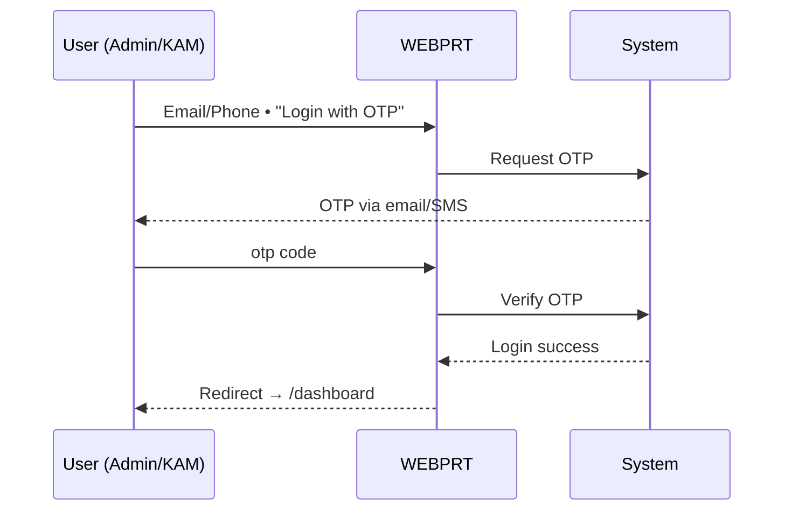
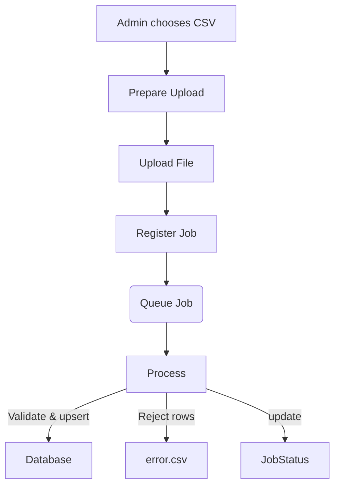
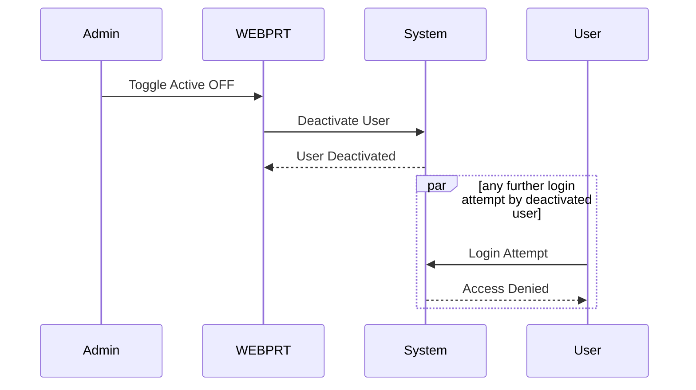
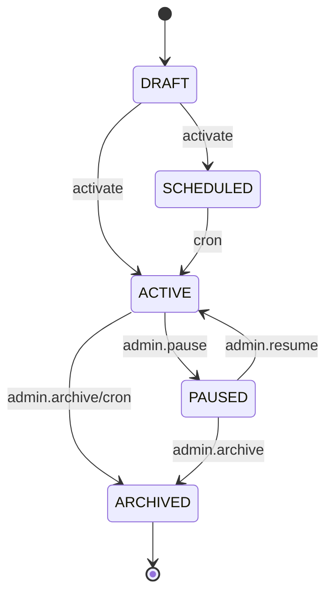

## L3-WF-WEBPRT: Workflow Details for WEBPRT – Browser-based portal for Admin and KAM users for master-data maintenance, promotion configuration, reconciliation and reporting.

### 1. Scope, Actors & Up-Stream Dependencies

The WEBPRT component is a web portal providing the only front-end channel for "back-office" personas.

| Actor     | Authentication Channel | Data Visibility                         | Authorisation Principle |
| --------- | ---------------------- | --------------------------------------- | ----------------------- |
| **Admin** | E-mail/SMS OTP             | All data                                | Full CRUD on every entity + global settings |
| **KAM**   | E-mail/SMS OTP             | Row-level filter = mapped parent stores | Read Only on every entity |

---

### 2. Interaction Contract (applies to every workflow)

1. **Authentication**: OTP validity 10 min , 5 attempts max. Lockout after 5 failed attempts within 10 minutes with 15-minute lockout window. KAM and Admin can use both e-mail and SMS channels.
2. **Session**: User sessions expire after 60 minutes of activity, with automatic refresh for active users.
3. **Pagination**:  100-row default for all list views.
4. **Time-zone convention**:  All times displayed in IST (Indian Standard Time).
5. **Autosave**:  Forms auto-save every 2 seconds. If another user modifies the same data, system displays "Draft updated elsewhere – Reload".

---

### 3. Workflow Catalogue

Each subsection introduces the intent, then lists step‑by‑step behaviour and system responses.

#### 3.1 Authentication & Session Bootstrap

This flow authenticates Admin and KAM users via e‑mail or SMS OTP .

##### 3.1.1 Happy Path

1. Admin/KAM accesses web portal
2. System displays input field for email OR phone number
3. User enters either email or phone and clicks 'Login with OTP'
4. System looks up user profile and sends same OTP to both registered SMS and Email channels
5. User receives OTP via both channels (if both registered)
6. User enters OTP received from either channel

##### 3.1.2 Failure & Resend Paths

* Wrong OTP ≤ 5 tries → error banner "The OTP is incorrect. Please try again."
* > 5 tries or expired → code invalidated; user must request new OTP.
* If the user clicks "Resend OTP", system sends new OTP only after the 60 s cooldown expires. After 5 failed attempts in 10 minutes, account is locked for 15 minutes.

#### 3.2 Dashboard Retrieval (Manual Refresh)

1. Dashboard loads with latest statistics.
2. Data refreshes automatically every 30 seconds.
3. Tiles update; timestamp shown bottom‑right.
4. If data unavailable, system shows "Data temporarily unavailable – retry later".

#### 3.3 Master‑Data CSV Upload (Lens, Frame, Store, User) – *Admin‑only*

##### 3.3.1 Upload Sequence

1. Admin selects CSV (≤ **50 MB**).
2. System uploads file directly to cloud storage.
3. System creates job and shows status as "Queued".
4. Job status appears in notification bell.

##### 3.3.2 Job Processing  

* System validates and processes rows, updating existing records and adding new ones. Duplicate `sku` **inside the same file** are rejected as "Duplicate-in-file".*  
Status transitions: QUEUED → RUNNING → PARTIAL | SUCCEEDED | FAILED.  
* On completion an in-app toast appears; bell icon offers download of the reject file (if any).  

---

#### 3.3 bis User Bulk-Upload CSV – *Admin-only*

The pattern mirrors §3.3.

1. Admin clicks "Bulk Upload Users" → selects CSV.
2. System uploads file to storage.
3. System creates job and returns job ID.
4. System validates phone numbers, roles, and store mappings.  
   • New user → INSERT  
   • Existing user (matched by phone) → UPDATE  
5. Reject file produced for rows with: duplicate phone in file, unknown store, invalid role, etc.

File schema:

| column           | mandatory | comment                           |
| ---------------- | --------- | --------------------------------- |
| name             | yes       |                                   |
| phone            | yes       | 10-digit                           |
| role             | yes       | ADMIN , KAM , Parent Store User, Store User
| email            | yes (for ADMIN/KAM)        | email type                          |
| status           | yes       | ACTIVE / INACTIVE                 |
| Parent StoreId   | depends   | comma-separated for KAM User, NULL  for other user |
| TR Store Id   | Depends   | single entry for Store User, comma separated for Parent Store User, NULL for other user |

---

#### 3.4 User Management (Manual)

* **Create / Edit** – Modal collects name, phone, role & store mapping.  Click "Save" to create or update user.
  **KAM users see this modal restricted to their mapped parent stores and cannot elevate any user to ADMIN.*
* **Deactivate** – Toggle "Active" → off .
* Deactivated users are immediately signed out and cannot login.

---

#### 3.4 bis Store-Group & Product-Group CRUD – *Admin-only*

Both groups are prerequisites for promotion rules.

##### 3.4 bis.1 Store-Group Workflow

1. Admin clicks "Manage Store Groups" → list view.  
2. "Create Group" opens form: name + attribute filter builder (nested AND/OR across {City, PinCode, State, Zone, DoorType, ServiceType, EL360, EE, LIS}).  
3. Click "Save" to create group with filter criteria.  
4. Edit or delete groups from list view.

##### 3.4 bis.2 Product-Group Workflow

Same steps, attributes come from combined Lens.{fields} and Frame.{fields}. Additional field `productType` = LENS | FRAME | BOTH.

---

#### 3.5 Promotion Lifecycle – *Admin-only*

##### 3.5.1 Status Model

Status enum = **DRAFT, SCHEDULED, ACTIVE, PAUSED, ARCHIVED**.

**Automated Status Transitions**: A daily scheduler automatically transitions promotion statuses based on dates:

* SCHEDULED → ACTIVE when startDate ≤ today
* ACTIVE → ARCHIVED when endDate < today

##### 3.5.2 Multi-Step Wizard

| Step | Primary Actions |  System Actions                                                                |
| ---- | --------------- | ------------------------------------------------------------------------ |
| 1    | Basic Info      |  Creates draft promotion         |
| 2    | Type            |  Sets promotion type                                 |
| 3    | Rule Builder    |  Configures rules with auto-save |
| 4    | Eligibility     |  Sets eligibility criteria                           |
| 5    | Review          |  Activates promotion                                    |

If `startDate` is in the future,  system sets status = `SCHEDULED`; otherwise it becomes `ACTIVE` immediately.

##### 3.5.3 Additional Quick-Actions (list view)

| Action  | Result                                   | Preconditions            | Post-condition |
| ------- | ------------------------------------------ | ------------------------ | -------------- |
| Pause   |  Pauses promotion            | status = ACTIVE          | status → PAUSED |
| Resume  |  Resumes promotion           | status = PAUSED          | status → ACTIVE |
| Archive |  Archives promotion          | status ∈ {ACTIVE,PAUSED} | status → ARCHIVED |
| Clone   |  Creates copy           | any status               | returns new `promotionId` with status = DRAFT |

##### 3.5.4 Test Console

Admin testing tool to verify promotion configuration. Input parameters = SKU list **and** `storeId`; `storeGroupId` optional. Returns applicable promotions and calculated discounts/benefits for testing purposes.

##### 3.5.5 State Diagram

---

#### 3.6 Transaction List & Reconciliation

##### 3.6.1 List View

* Default filter = last 30 days, status ANY, scoped by mapped stores for KAM.
* Invoice No. & PID fields are **read-only**; supplied by mobile app.
* Only Admin can change status (`Under Review` → `Verified` → `Settlement Complete`). KAM has read-only access to status.

##### 3.6.2 Bulk CSV Status Update – *Admin-only*

* Upload CSV to bulk update transaction statuses.
* File schema: `transactionId,status`
* Note: Invoice Number and PID Number are part of the reconciliation process that happens post-transaction. These fields are handled separately from the status update and are entered via mobile app during reconciliation.
* System enforces status progression rules. Any invalid transition is written to the reject file.

---

#### 3.7 KAM  Workflow

1. KAM navigates to "WEBPROTAL".  
2. Data is pre-filtered to `mappedStoreIds` based on KAM's assigned stores.  
3. Cannot modify data outside assigned stores. System shows "Permission denied".

---

### 4. Integration Touch-Points

The web portal integrates with:

* **OTP Delivery**: Email and SMS via MSG91
* **File Storage**: CSV uploads and marketing banners
* **Backend Services**: All data operations and business logic

---

### 5. Error & Edge-Case Handling Matrix

| Scenario                                   | Portal Behaviour                                              | |
| ------------------------------------------ | ------------------------------------------------------------- | -------- |
|  Session expired                                |  Automatic refresh or redirect /login            |      |
|  Session timeout                      | Redirect /login + toast "Session expired"                     |   |
| Partial success in CSV ingest              | Jobs Bell shows "PARTIAL"; download reject CSV                |       |
|  Concurrent edit conflict            | Snackbar "Reload to latest"                                   |      |
| Oversized CSV (>50 MB)                     | Client blocks upload                |       |
|  Upload failure            | Modal error; "Retry upload" button                            |   |
| Promotion state conflict (e.g., pause on archived) | Toast "Invalid state transition"                      |    |
| Job stuck >15 min in QUEUED/RUNNING        | Bell shows "Stalled"; Admin link to "Re-queue"                |       |
| KAM attempts cross-store user change       | Toast "Permission denied"                                     |      |

--

---

End of Document